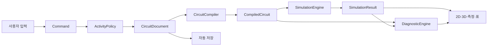

# 상태 흐름과 처리 파이프라인

## 편집에서 화면 갱신까지



## 처리 순서

1. 사용자 입력을 명령으로 변환한다.
2. `ActivityPolicy`가 현재 역할에서 명령을 허용하는지 검사한다.
3. 명령은 새 `CircuitDocument`를 만든다.
4. 변경 범위에 따라 연결망을 다시 만들거나 기존 결과를 재사용한다.
5. `SimulationEngine`이 수치 결과를 반환한다.
6. `DiagnosticEngine`이 구조·수치 진단을 반환한다.
7. 2D, 3D, 측정, 표가 같은 결과를 구독한다.
8. 스키마 검증을 통과한 안정 상태를 자동 저장한다.

## 변경별 재계산

| 변경 | 처리 |
|---|---|
| 부품 위치만 이동 | 연결이 같으면 계산 결과를 재사용하고 2D·3D 위치만 갱신한다. |
| 저항값 변경 | 연결망을 재사용하고 행렬과 결과를 다시 계산한다. |
| 도선 연결 변경 | 연결망부터 다시 만들고 전체 결과를 갱신한다. |
| 라벨·문제 표시 변경 | 계산을 재사용하고 출력·문제 레이어만 갱신한다. |
| 기준점 변경 | 해를 기준 이동하거나 단순성을 위해 다시 계산할 수 있다. 결과 불변식을 유지한다. |

## 진단 데이터

진단은 다음을 포함한다.

```ts
interface Diagnostic {
  code: string;
  severity: 'info' | 'warning' | 'error';
  affectedIds: string[];
  parameters: Record<string, number | string | boolean>;
  suggestedActions: string[];
}
```

계산 모듈은 사용자용 한국어 문장을 직접 생성하지 않는다. UI는 `code`와 `parameters`를 사용해 학생용·교사용 문구를 구성한다.
