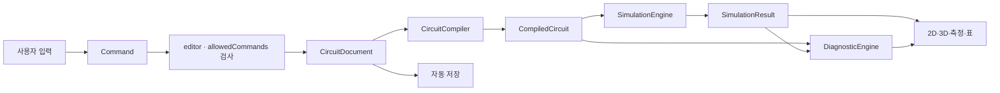

# 상태 흐름과 처리 파이프라인

## 편집에서 화면 갱신까지



## 처리 순서

1. 사용자 입력을 명령으로 변환한다.
2. app의 세션 훅에서 화면 모드 제한을 확인하고, editor의 `previewCommand`가 `document.activity.allowedCommands`를 검사한다. 독립 ActivityPolicy 객체는 현재 없다.
3. 명령이 새 `CircuitDocument`를 만들고 구조 검증을 통과하면 이력에 반영한다. 묶음 명령은 모두 성공한 뒤 한 번에 반영한다.
4. App의 `useMemo([doc])`가 변경된 문서를 `app/analyze`에 전달해 연결망을 다시 만든다.
5. 컴파일 오류가 없으면 `dcEngine.solve`가 수치 결과를 반환한다. 오류가 있으면 수치를 비운 실패 결과를 만든다.
6. `evaluateDiagnostics`가 컴파일·계산 진단을 모아 중복을 제거한다.
7. 2D, 3D, 측정, 표에 같은 계산 결과를 전달한다. 등가저항·값 변화 실험은 별도 공개 계산 함수를 호출한다.
8. 문서 변경 후 450ms 동안 추가 변경이 없으면 persistence를 통해 검증·자동 저장한다.

## 변경별 재계산

| 변경 | 처리 |
|---|---|
| 확정된 문서 변경: 위치·라벨·값·연결·기준점 | 연결망부터 계산·진단까지 다시 수행한다. |
| 선택·호버·카메라·색상표·높이 | 문서를 바꾸지 않으므로 회로 계산을 재사용한다. 필요한 표시 모델만 갱신한다. |
| 드래그 미리보기 | Canvas에서 `previewCommand`로 임시 문서를 만들며 App의 확정 문서·계산·자동 저장은 바꾸지 않는다. |

변경 종류별 연결망·계산 캐시는 아직 구현하지 않았다. 실제 성능 측정으로 필요성이 확인되면 위치·라벨 변경의 재사용부터 검토한다. 문서의 전기적 의미와 진단이 달라지는 변경을 잘못 재사용하지 않는 것이 우선이다.

## 진단 데이터

진단은 다음을 포함한다.

```ts
interface Diagnostic {
  code: string;
  severity: 'info' | 'warning' | 'error';
  affectedIds: string[];
  parameters: Record<string, number | string | boolean | null>;
  suggestedActions: string[];
}
```

계산 모듈은 사용자용 한국어 문장을 직접 생성하지 않는다. UI는 `code`와 `parameters`를 사용해 학생용·교사용 문구를 구성한다.
