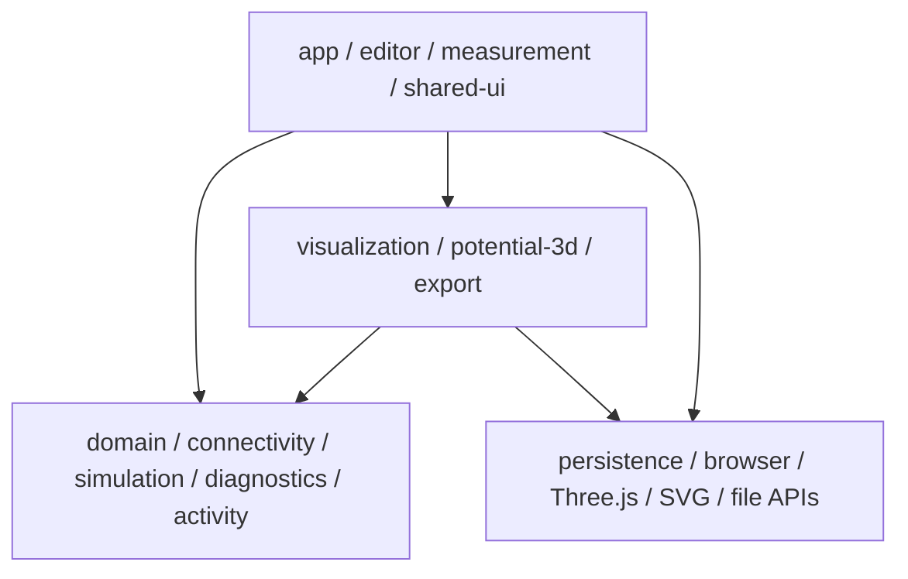

# 기술 구조 개요

## 구조 원칙

- `CircuitDocument`가 저장과 공유의 유일한 원본이다.
- 편집, 연결망, 계산, 진단, 시각화, 출력, 저장을 분리한다.
- 안쪽의 물리·데이터 모듈은 바깥의 UI 기술을 알지 않는다.
- 초기에는 하나의 저장소와 한 앱 안에서 폴더 경계를 지킨다.
- 실제 재사용 필요가 생긴 뒤에만 독립 패키지로 분리한다.

## 계층



`CORE`는 `UI`, `VIEW`, `INFRA`를 import하지 않는다.

## 권장 디렉터리

```text
src/
  app/                화면 조합, 라우팅, 전역 오류 경계
  domain/             회로 문서 타입, 단위, ID, 스키마
  component-library/  부품 정의, 단자, SVG 기호
  connectivity/       단자·도선을 net으로 묶는 컴파일러
  simulation/         MNA 직류 해석과 결과 타입
  diagnostics/        오류·경고 규칙
  editor/             선택, 배치, 배선, 명령, 실행 취소
  measurement/        탐침, 전류계 삽입, 측정 기록
  visualization/      전위 색·숫자·전류 레이어
  potential-3d/       Three.js 전위 높이 어댑터
  activity/           학생 권한, 예측, 공개 단계
  export/             SVG, PNG, 클립보드
  persistence/        자동 저장, JSON, 마이그레이션
  fixtures/           기준 회로와 예상 결과
  shared-ui/          일반 UI; 물리 지식 없음
```

## 초기 기술 선택

| 영역 | 기준 |
|---|---|
| 웹 앱 | React + TypeScript + Vite |
| 2D 회로 | 자체 SVG 편집기 |
| 3D 전위 | Three.js 기반 어댑터 |
| 직류 계산 | 자체 MNA 엔진 |
| 상태 변경 | 명령 기반 문서 저장소와 별도 UI 상태 |
| 저장 | IndexedDB 또는 동등한 로컬 저장 + JSON 파일 |
| 배포 | 정적 웹 배포 우선 |

구체적인 라이브러리 선택은 관련 ADR에서 확정한다.
