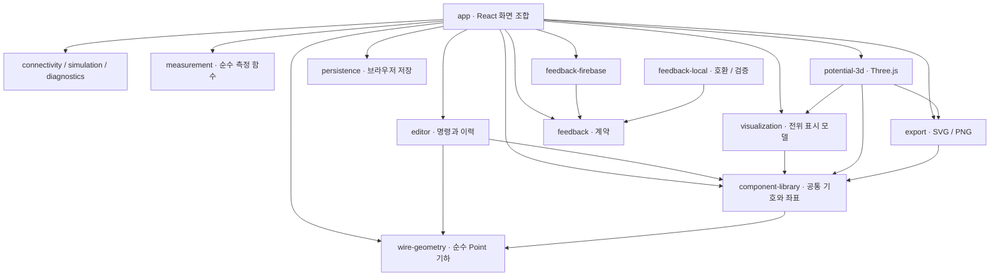

# 기술 구조 개요

## 구조 원칙

- `CircuitDocument`가 저장과 공유의 유일한 원본이다.
- 편집, 연결망, 계산, 진단, 시각화, 출력, 저장을 분리한다.
- 안쪽의 물리·데이터 모듈은 바깥의 UI 기술을 알지 않는다.
- 초기에는 하나의 저장소와 한 앱 안에서 폴더 경계를 지킨다.
- 실제 재사용 필요가 생긴 뒤에만 독립 패키지로 분리한다.

## 현재 모듈 의존 방향

화살표는 import하는 쪽에서 사용되는 모듈 쪽을 향한다. 공통 `domain` 타입 의존과 작은 보조 모듈의 연결은 아래 설명으로 묶었다.



`domain`은 다른 기능 모듈에 의존하지 않는다. 회로 모듈들은 이곳의 문서·계산 계약을 사용하며 `wire-geometry`는 Point 타입만 사용한다. `connectivity`, `simulation`, `diagnostics`, `measurement`는 React·브라우저 없이 동작한다. `editor`도 순수 명령 처리이며 포인터·선택 상태는 `app`에 둔다.

`notation`은 editor·component-library·export·app에서 사용하는 순수 표기 함수다. `typography`는 export의 글꼴 자원을 제공한다. 예제 `fixtures`는 app에서 읽는다. 후기 모듈은 회로 문서에 의존하지 않는다. 모듈 간 공개 index와 순환 의존성은 `tools/check-boundaries.mjs`로 검사한다.

## 현재 디렉터리

```text
src/
  app/                화면 조합, 라우팅, 전역 오류 경계
  domain/             회로 문서·계산 계약, ID, 검증·마이그레이션
  component-library/  부품 정의, 단자, SVG 기호
  connectivity/       단자·도선을 net으로 묶는 컴파일러
  simulation/         MNA 직류 해석과 결과 타입
  diagnostics/        오류·경고 규칙
  editor/             문서 변경 명령, 권한 검사, 실행 취소
  wire-geometry/      직각 경로·국소 변형·정리의 순수 함수
  measurement/        탐침, 비접촉 전류 측정, 측정 기록
  visualization/      전위 색·숫자·전류 레이어
  potential-3d/       Three.js 전위 높이 어댑터
  export/             SVG, PNG, 클립보드
  persistence/        자동 저장, JSON 입출력, domain 검증 사용
  notation/           수치·분수·첨자 표기
  typography/         공통 글꼴·표기 배치
  feedback/           후기 공개 계약과 입력 정책
  feedback-firebase/  운영 게시판 어댑터
  feedback-local/     이전 로컬 자료와 계약 검증용 어댑터
  fixtures/           기준 회로와 예상 결과
```

학생 권한의 기본 계약은 현재 `domain`·`editor`에 있으며 독립 활동 모듈은 단계 6의 후속 범위다.

## 기술 선택

| 영역 | 기준 |
|---|---|
| 웹 앱 | React + TypeScript + Vite |
| 2D 회로 | 자체 SVG 편집기 |
| 3D 전위 | Three.js 기반 어댑터 |
| 직류 계산 | 자체 MNA 엔진 |
| 상태 변경 | 명령 기반 문서 저장소와 별도 UI 상태 |
| 회로 저장 | 브라우저 `localStorage` + JSON 파일 |
| 후기 | Firebase Auth + Firestore |
| 배포 | GitHub Pages 정적 웹 배포 |

모듈별 책임은 [모듈 구성](modules.md), 저장과 게시판의 실제 계약은 [저장·복구·공유](persistence-and-sharing.md)와 [게시판 구조](feedback.md)를 따른다.
