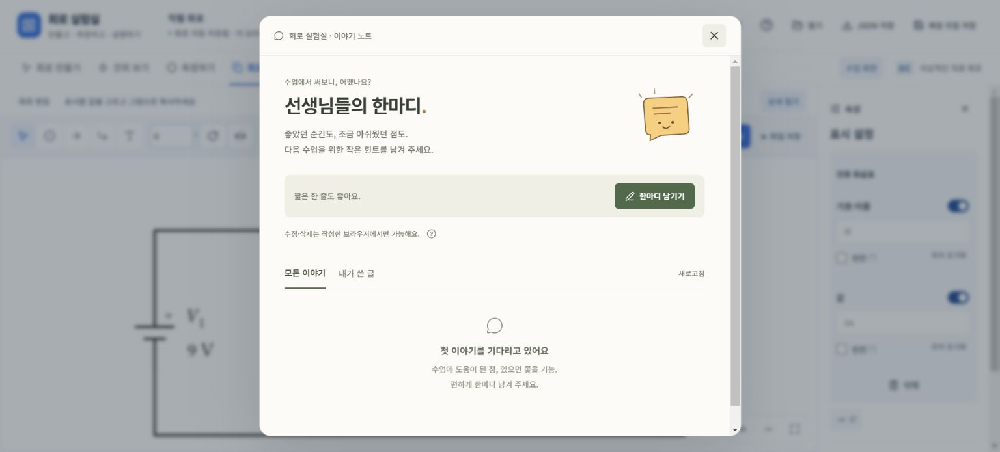
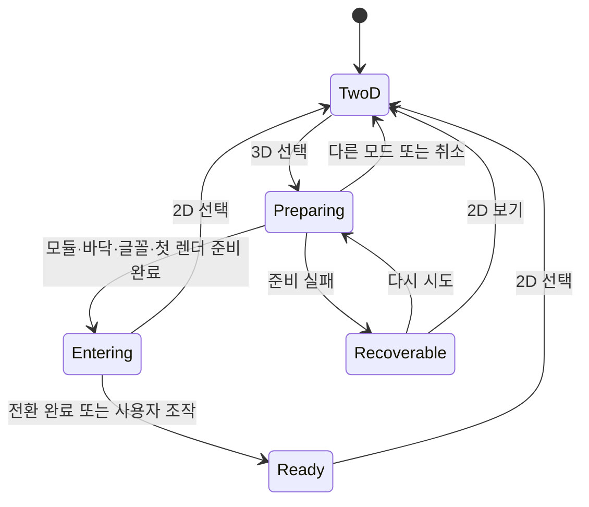

# 프론트엔드 디자인 검토와 개선 제안

작성일: 2026-09-24 · 검토 기준: `ad5ad76`의 로컬 앱 · 상태: **구현 반영 — 2026-09-24**

아래 1~11장은 구현 전 검토 근거와 제안을 보존한다. 실제 반영과 검증 범위는 마지막 12장을 기준으로 읽는다.

## 1. 디자인 방향

**‘한마디’의 편안한 말투와 절제된 화면 구성을 앱 전체의 기준으로 삼는다. 회로는 선명하게, 도구는 조용하게, 조작의 결과는 매끄럽게 이어지는 작업 화면을 만든다.**

현재 앱은 직접 배선, 회로 위 이름·값 편집, 출력 장식의 드래그 등 좋은 조작 기반을 갖췄다. 그러나 그 주변에 개발 설명, 반복 안내, 비슷한 상자와 작은 글씨가 누적되어 실제 기능보다 복잡하고 딱딱하게 느껴진다. 화면 전환과 로딩은 이 인상을 더 강하게 만든다.

이번 개선의 중심은 새로운 장식이나 기능이 아니라 **정보를 덜어내고, 행동의 위계를 세우고, 상태 사이를 연결하는 것**이다. 전체를 다른 제품처럼 바꾸기보다 이미 잘된 ‘한마디’와 회로 직접 조작을 하나의 디자인 언어로 묶는다.

- 따뜻한 회백색 UI, 짙은 잉크색 글자, 절제된 올리브색 주 행동을 기본 방향으로 제안한다.
- 회로·출력 영역은 흰색을 유지한다. 전위의 열화상 색상은 물리량에만 사용한다.
- 사각 카드의 반복을 줄이고 정렬·간격·얇은 구분선으로 구조를 표현한다.
- 버튼 문구는 짧은 행동, 안내는 필요한 순간의 한 문장, 자세한 설명은 사용자가 여는 도움말에 둔다.
- 반복 조작은 빠르게 반응하고, 2D에서 3D로 이어지는 장면처럼 의미 있는 순간에만 더 풍부한 모션을 쓴다.

여기서 ‘AI 슬롭’은 생성 도구의 사용 여부를 뜻하지 않는다. 제품의 맥락과 무관한 카드, 배지, 그라데이션, 큰 모서리, 반복 카피가 기본 템플릿처럼 쌓인 결과를 가리킨다. **모서리를 각지게 바꾸거나 파란색을 다른 색으로 바꾸는 것만으로는 해결되지 않는다.** ‘한마디’에도 둥근 버튼과 패널이 있지만, 역할과 강조가 분명해서 더 자연스럽다.

## 2. 검토 근거와 범위

로컬 `http://127.0.0.1:5178/`에서 회로 만들기, 전위 2D·3D, 측정, 회로도 출력, ‘한마디’를 확인했다. 1536×695 CSS 픽셀 화면의 캡처·DOM과 현재 소스를 함께 검토했다. 기존 직렬 회로와 출력 화살표가 있는 작업 상태를 사용했다.

- 상세 패널은 **이미 기본 접힘**이다. 펼쳐진 화면의 문제를 기본 화면 전체의 문제로 확대 해석하지 않는다.
- 부품 강조에는 이미 탄성 전환이 있고, 3D에도 1.1초의 유한한 상승·기울임 전환이 있다. ‘애니메이션이 전혀 없다’는 진단은 부정확하다.
- 3D 첫 진입에서 텍스트 로딩 상태를 DOM으로 확인했다. 로딩의 실제 소요 시간, 프레임 속도, 네트워크 병목은 측정하지 않았다. 아래의 준비 단계 문제는 코드 경로에서 확인한 사항과 설계 제안을 구분한다.
- 모바일은 반응형 CSS를 검토했다. 이번 브라우저에서는 요청한 뷰포트 크기가 실제 화면에 반영되지 않아 모바일 캡처를 근거로 사용하지 않았다. 실제 휴대전화 조작이나 모바일 레이아웃 검증 완료를 주장하지 않는다.
- 앱 코드·스타일·데이터 계약은 수정하지 않았다. 이 문서는 구현 지침의 제안이며 기존 accepted 요구사항과 ADR을 대체하지 않는다.

| 근거 화면 | 확인한 내용 |
|---|---|
| [회로 만들기 · 기본 접힘](assets/2026-09-24-design-review/07-build-collapsed.png) | 상단 네 층의 UI, 반복 안내, 부품 목록 |
| [회로 만들기 · 상세 펼침](assets/2026-09-24-design-review/03-build.png) | 빈 속성 패널, 요약 카드, 복원 문구 |
| [전위 2D](assets/2026-09-24-design-review/04-potential-2d.png) | 범례·기준점, 전위 표지, 설명이 많은 상세 패널 |
| [전위 3D](assets/2026-09-24-design-review/05-potential-3d.png) | 장면 크기, 도구·라벨·기준면의 위계 |
| [측정](assets/2026-09-24-design-review/06-measure.png) | 탐침 카드, 기록 영역, 저장 안내 |
| [회로도 출력](assets/2026-09-24-design-review/01-output.png) | 잘된 직접 편집과 중첩된 도구·설정 영역 |
| [한마디](assets/2026-09-24-design-review/02-feedback.png) | 말투·색·제목·주 행동의 기준 |

## 3. 최근 디자인 흐름에서 가져올 원칙

2026-09-24에 확인한 공식 제품 글과 디자인 시스템을 근거로 한다. 날짜가 있는 2024~2025년의 주요 리디자인 사례와 현재 공개 가이드를 함께 살폈다. 특정 외형을 ‘2026년의 정답’으로 단정하지 않는다. 아래의 우리 앱 적용안은 출처를 바탕으로 한 설계 판단이다.

| 참고 흐름·공식 근거 | 실제로 배울 점 | 우리 앱에 적용할 것 | 그대로 가져오지 않을 것 |
|---|---|---|---|
| **Linear · 차분한 도구 UI** — [2024-03-28 리디자인](https://linear.app/now/how-we-redesigned-the-linear-ui) | 헤더·탭·패널의 정렬, 시각적 소음 감소, 중성색과 명확한 위계 | 상단 높이 축소, 같은 역할의 도구 정렬, 배경색·테두리의 절제 | 어두운 개발 도구 외형, 작은 글씨와 과밀한 정보 |
| **Figma UI3 · 작업물 중심의 캔버스** — [2024-10-01 설계 회고](https://www.figma.com/blog/our-approach-to-designing-ui3/), [2025-03-25 전환 안내](https://www.figma.com/blog/making-the-move-to-ui3-a-guide-to-figmas-next-chapter/) | 작업물에 집중하는 구조, 필요할 때 여는 도구. 떠 있는 패널이 작업을 방해해 일부를 다시 고정한 경험 | 회로 위치를 유지하는 모드 전환, 접히는 상세 패널, 문맥 도구 | 모든 패널을 띄우거나 호버에 숨겨 캔버스를 가리는 방식 |
| **Material 3 Expressive · 목적이 있는 표현** — [Google의 설계·연구 설명](https://design.google/library/expressive-material-design-google-research) | 크기·색·형태·움직임을 써서 중요한 행동을 찾기 쉽게 함. 익숙한 조작과 명칭을 깨면 사용성이 나빠질 수 있음 | ‘그림 복사’ 같은 주 행동의 분명한 강조, 선택·완료 상태의 짧은 반응 | 모든 버튼을 크고 둥글게 만들기, 과한 색과 바운스, 라벨의 일괄 삭제 |
| **Apple Liquid Glass · 콘텐츠와 제어의 층 구분** — [2025-06-09 발표](https://www.apple.com/newsroom/2025/06/apple-introduces-a-delightful-and-elegant-new-software-design/) | 콘텐츠와 제어를 분리하고 문맥에 따라 도구가 변하는 연속성 | 3D 위의 작은 카메라 도구, 패널 진입·종료의 연결감 | 회로선·눈금 위의 굴절, 넓은 유리 패널, 상시 블러와 반짝임 |
| **Carbon·Vercel · 기능을 설명하는 모션** — [Carbon Motion](https://carbondesignsystem.com/elements/motion/overview/), [Vercel Web Interface Guidelines](https://vercel.com/design/guidelines) | 반복 작업의 짧은 모션과 중요한 전환을 구별. 입력으로 중단 가능하고 움직임 감소를 존중 | 도구·패널·비동기 작업에 공통 전환 규칙, 3D 준비와 표현의 분리 | 모든 요소의 순차 등장, 끊임없는 장식 애니메이션, 효과를 보여주기 위한 대기 |
| **Atlassian · 작업을 돕는 콘텐츠 디자인** — [Voice and tone](https://atlassian.design/server/foundations/writing-style/), [Info messages](https://atlassian.design/foundations/content/designing-messages/info-messages) | 상황에 맞는 짧고 정확한 말투, 필요한 정보를 준 뒤 작업으로 돌려보냄 | ‘한마디’의 편안함을 행동 문구와 오류 설명에 확장 | 매 화면의 환영 문장, 습관적인 격려, 오류 상황의 농담 |

추천 조합은 **Linear의 정렬과 절제 + Figma의 작업물 중심 구조 + ‘한마디’의 색과 말투 + 목적이 분명한 모션**이다. Material과 Apple은 강조·연속성의 원칙을 참고하되 외형을 복제하지 않는다.

## 4. ‘한마디’에서 유지하고 확장할 것



‘수업에서 써보니, 어땠나요?’, ‘한마디 남기기’, ‘내가 쓴 글’은 내부 데이터 구조를 설명하지 않고 사용자의 행동과 경험을 가리킨다. 따뜻한 바탕, 짙은 제목, 차분한 올리브 버튼, 얇은 구분선이 서로 다른 역할을 맡는다. 입력 전부터 많은 필드를 펼치지 않고 행동 하나로 시작하는 점도 좋다. 근거: [FeedbackBoard.tsx](../../src/app/FeedbackBoard.tsx), [feedback.css](../../src/app/feedback.css).

전역에 확장할 것은 색의 온도, 짧고 구체적인 말, 강조의 절제, 충분한 글자 대비다. 큰 제목·넓은 여백·삽화는 게시판에 적합한 표현이므로 편집 툴바에는 그대로 옮기지 않는다. 학생도 쓰는 편집 화면에는 ‘선생님’ 호칭을 반복하지 않는다.

또한 ‘한마디’도 완성된 로딩 기준은 아니다. 모듈을 여는 동안 파란 토스트 ‘게시판을 여는 중…’가 나타나고, 내용은 별도로 ‘이야기를 불러오는 중…’를 표시한다. 두 단계를 대화상자 안의 한 로딩 경험으로 묶을 필요가 있다. 수정·삭제 권한과 개인정보 안내는 실제 의사결정에 필요한 정보이므로 단순히 길다는 이유로 없애지 않는다.

## 5. 문제별 개선 제안

### D01. 개발 설명과 중복 안내가 상시 노출된다 — 우선순위 P0

**관찰:** 상단의 `DC 이상적인 직류 회로`, 캔버스의 같은 문구, 저장 상태와 `로그인 없이, 이 기기에 저장`, 도구 위의 안내 문장, ‘다음 행동’ 카드가 겹친다. 화면을 사용하는 데 필요한 정보보다 제품의 구현과 의도를 설명하는 문장이 많다. [App.tsx](../../src/app/App.tsx)의 `mode-meta`, `workspace-actions`, `library-bottom`, [CircuitCanvas.tsx](../../src/app/CircuitCanvas.tsx)의 `canvas-caption`이 해당한다.

**제안:** 모델 범위와 저장 방식은 도움말·파일 메뉴에서 확인하게 한다. 정상 작업 중 상시 안내 행과 다음 행동 카드를 제거한다. 빈 회로에는 `부품을 놓아 시작해 보세요` 정도의 한 문장을 허용하되 첫 부품 이후에는 사라지게 한다. 실행을 막는 오류는 문제 위치와 고치는 행동을 먼저 보여준다.

**완료 기준:** 정상 회로의 기본 작업 화면에 개발 용어·반복 설명이 없고, 저장 실패와 잘못된 연결은 여전히 알아볼 수 있다. 일반 호버·클릭 설명 버블과 하단 안내를 되살리지 않는다.

### D02. 저장·복원 동작의 이름과 위치가 어렵다 — P0

**관찰:** `JSON 저장`, `복원 지점 저장`, 속성 패널의 `회로 복원 지점으로 돌아가기`가 서로 떨어져 있다. 회로 파일, 자동 저장, 수동 보관의 차이를 사용자가 추측해야 한다. 출력 속성에서도 회로 전체 복원 버튼이 나타난다. `downloadJson`은 현재 파일 다운로드와 수동 보관을 함께 수행한다.

**제안:** 상단 `파일` 메뉴에 `회로 파일 열기`, `회로 파일 저장`, 별도 그룹의 `현재 회로 보관`, `보관한 회로 불러오기`를 모은다. JSON은 파일 형식 안내에만 남긴다. 보관 상태는 이름과 확인 가능한 시각이 있으면 함께 표시하고, 보관 항목이 없으면 불러오기를 비활성화한다. 기존 저장 동작을 바꿀 필요가 있다면 명칭 변경과 구분해 설계한다.

자동 저장 성공은 조용한 체크 아이콘과 접근성 이름으로 표시한다. 저장 위치와 한계는 파일 메뉴 안에 짧게 남긴다. 실패는 `저장하지 못했어요`와 `회로 파일 저장` 행동을 명시한다. 수동 복원은 기존 보호·실행 취소 흐름을 보존하고 현재 편집을 잃게 하는 조용한 교체를 만들지 않는다.

**완료 기준:** 출력·속성 편집 중 전체 회로 복원 동작이 끼어들지 않는다. ‘파일 저장’과 ‘브라우저에 보관’을 이름·그룹으로 구별할 수 있다. 이 제안은 자동 저장이나 복구 기능 삭제가 아니다. 관련: DAT-001~003.

### D03. 상단 UI가 네 층으로 쌓여 회로 공간을 줄인다 — P0

**관찰:** 회로 만들기의 기본 접힘 상태에서도 앱 헤더 → 모드 탭 → 안내·상세 행 → 편집 도구 행이 이어진다. 1536×695 화면에서 회로 영역의 위쪽은 약 234px, 높이는 461px였다. 세로 공간 약 34%가 회로 위에 쓰인다. 상세 패널만 접어서는 해결되지 않는다.

**제안:** 문서 헤더 52px, 모드 탐색 44px, 현재 도구 44px의 세 층을 초기 목표로 삼는다. 별도 안내 행을 없애고 상세 열기 버튼을 도구 행 끝에 합친다. 이 수치는 디자인 초안이며 글자를 줄여 억지로 맞추는 고정 규격이 아니다. 정상 데스크톱 편집에서 회로 위 UI를 140~152px 수준으로 줄이면 현재보다 약 82~94px를 확보할 수 있다.

모드 이름은 익숙한 네 가지를 유지한다. 전위·출력의 `회로 편집` 중복 진입은 기존 탭으로 통합한다. 모드 변경 시 같은 회로의 중심·확대·선택 가능한 대상을 유지하고, 패널 폭 변화 때문에 매번 전체 맞춤을 다시 실행하지 않는다.

**완료 기준:** 1536×695에서 불필요한 안내 행 없이 주요 도구가 보인다. 모드·패널 전환 때문에 사용자가 보고 있던 부품을 다시 찾아야 하지 않는다.

### D04. 여러 도구가 비슷한 둥근 상자로 보인다 — P0

**관찰:** 부품 타일, 파란 선택 배경, 요약 카드, 탐침 카드, 출력 표기 패널이 비슷한 테두리·배경·모서리로 반복된다. 현재 모드, 눌러야 할 주 행동, 단순 정보가 서로 비슷한 무게를 갖는다. [styles.css](../../src/app/styles.css), [ux.css](../../src/app/ux.css), [measurement.css](../../src/app/measurement.css).

**제안:** 모양을 역할에 따라 나눈다.

| 역할 | 제안하는 표현 |
|---|---|
| 모드 탐색 | 평평한 텍스트 탭 + 이동하는 짧은 밑줄. 현재 밑줄 구조를 다듬는다. |
| 반복 편집 도구 | 정렬된 아이콘·짧은 이름. 기본 상태는 투명, 선택 상태만 옅은 면과 분명한 잉크색 |
| 부품 팔레트 | 실제 회로 기호와 이름. 타일마다 상시 테두리를 두지 않고 간격으로 구분 |
| 핵심 실행 | `그림 복사`처럼 결과를 만드는 행동 하나에만 진한 채움 |
| 설정 그룹 | 제목·필드·간격·구분선으로 구획. 바깥 카드 안에 다시 카드를 넣지 않음 |
| 원형 조작 | 끝점 손잡이, 접점, 닫기처럼 원형이 자연스러운 소형 제어 |

**완료 기준:** 눈을 가늘게 뜨고 보아도 회로, 현재 모드, 핵심 행동의 우선순위가 구별된다. 버튼을 전부 아이콘으로 바꾸거나 전부 각지게 만들지 않는다.

### D05. UI와 회로의 색·글자 체계가 서로 경쟁한다 — P1

**관찰:** 메인 UI는 차가운 청회색·작은 글씨·파란 강조를 광범위하게 사용하고 ‘한마디’만 별도 분위기를 갖는다. 전위의 밝은 노란 표지는 흰 바탕에서 약해 보인다. 대비 수치는 아직 측정하지 않았으므로 접근성 실패 판정과는 구분한다.

**제안:** UI는 따뜻한 중성색과 짙은 글자로 통일한다. 전위 색상은 도선·색상 표지에 쓰고 숫자는 짙은 중성색으로 읽히게 한다. 밝은 전위색의 도선은 필요한 경우 가는 중성색 밑선을 검토하되, 값에 대응하는 공통 열화상 팔레트를 임의로 바꾸지 않는다.

UI의 본문·입력·도구 이름은 13~14px 중심, 보조 문구는 12px 이상을 출발점으로 삼는다. 모든 글씨를 같은 크기·굵기로 만들지 않는다. ‘한마디’의 큰 제목은 그곳의 위계로 유지한다. 회로의 Libertinus Math, 기호 이탤릭·숫자/단위 정자, 아래첨자·분수 규칙은 그대로 보존한다.

**완료 기준:** UI 강조색이 전위 범례처럼 읽히지 않는다. 밝은 전위 숫자도 읽을 수 있다. 색만으로 활성·선택·오류를 전달하지 않는다. 관련: VIS-001~003, VIS-007, QLT-001.

### D06. 속성 패널이 상황보다 많은 내용을 보여준다 — P1

**관찰:** 상세를 열면 선택 안내, 회로 요약, 표기 설정, 복원 동작 등이 한 패널에 모인다. 전위 패널은 여러 물리 설명을 긴 문단으로 보여준다. 출력에는 `속성 → 표시 설정 → 전류 화살표`처럼 제목이 중첩된다. 검토 중 출력 장식을 선택한 상태에서 만들기로 이동하자, 보이지 않는 장식 선택에 대응하는 `선택 요소 삭제`도 나타났다.

**제안:** 패널 제목은 현재 대상인 `저항 R₁`, `화살표`, `보기 설정`으로 바로 시작한다. 대상이 없으면 불필요한 빈 패널을 열어두지 않는다. 모드 전환 시 현재 모드에서 다룰 수 없는 선택은 해제하거나 해당 모드에만 보관한다. 기본값이 접힘인 현재 정책은 유지한다.

출력의 기호·값 입력 UI를 재사용하는 현재 구조는 유지하고 내부의 큰 카드·중복 제목을 줄인다. 접지·투명 배경·고해상도는 ‘그림 설정’ 한 그룹으로 묶는다. 자세한 물리 설명은 해당 기능의 도움말에서 열게 하되 기준점·단위·부호는 작업 화면에 남긴다.

**완료 기준:** 선택한 요소와 그 요소에 가능한 행동만 보인다. 출력 장식 때문에 만들기 화면에 삭제 동작이 나타나지 않는다. 이름·값의 독립 이동과 표시·빈칸 기능을 그대로 사용할 수 있다.

### D07. 전환의 시작과 끝이 연결되지 않는다 — P1

**관찰:** 일반 버튼에는 색 변화가 있지만, 모드 조건부 렌더링·`hidden` 패널·대화상자에는 공통 진입/종료 규칙이 없다. 부품의 탄성 강조만 상대적으로 눈에 띈다. 이 차이가 전체 경험을 들쭉날쭉하게 만든다.

**제안:** 모드의 활성 표시, 상세 패널, 대화상자, 메뉴에 같은 모션 규칙을 적용한다. 회로 자체는 유지하고 바뀌는 도구만 짧게 전환한다. 패널이 닫힐 때도 종료 프레임을 보여준 뒤 제거한다. 모든 버튼·문장에 확대나 바운스를 걸지 않는다. 이미 만족한 부품의 작은 상승·확대는 유지한다.

**완료 기준:** 빠르게 모드를 바꾸거나 패널을 닫아도 이전 애니메이션이 뒤늦게 재등장하지 않는다. 애니메이션 때문에 클릭이나 키보드 입력이 대기하지 않는다. 구체적인 시간과 예외는 8절을 따른다.

### D08. 3D 로딩이 현재 회로와 시각적으로 단절된다 — P0

**관찰:** [App.tsx](../../src/app/App.tsx)는 3D 모듈 로딩 중 회로 자리를 `3D 보기를 준비하고 있습니다…` 문단으로 교체한다. 이후 [potential-3d/index.tsx](../../src/potential-3d/index.tsx)는 WebGL 초기화, 바닥 회로 SVG 이미지 로드, 높이·카메라 전환을 서로 다른 경로로 처리한다. 바닥 텍스처와 전환 시작을 함께 기다리는 준비 계약은 없다. 따라서 첫 완성 장면의 순서를 일관되게 보장하기 어렵다. 실제 지연의 크기는 별도 측정 대상이다.

**제안:** 현재 2D 회로를 보존한 채 3D를 준비한다. 준비가 끝나면 같은 위치의 회로가 기울고 전위만 높이로 바뀌게 한다. 준비가 늦을 때만 3D 버튼 안에 작은 비결정 진행 표시를 넣는다. 화면 중앙의 문단·큰 스피너·가짜 진행률은 사용하지 않는다. 자세한 상태 설계는 9절을 따른다.

**완료 기준:** 첫 진입·재진입·실패·준비 중 취소 모두 흰 빈 화면이 생기지 않는다. 성공 전까지 기존 회로를 유지하고, 실패 시 같은 영역에서 재시도나 2D 사용으로 이어진다. 관련: VIS-004, ADR-006.

### D09. 3D 시점 변경과 주석의 위계도 다듬어야 한다 — P1

**관찰:** `사선/정면/위에서`는 `cameraPose`로 즉시 바뀐다. 현재 3D 화면에는 범례의 `기준 V1.n · 0 V`와 바닥의 `기준면 0 V V1.n · 0 V`가 반복되고, 수학 표지가 작은 흰 상자 형태로 여럿 떠 있다. 장면 자체보다 주변 설정과 문구가 눈에 들어온다.

**제안:** 카메라 프리셋은 짧게 보간하고 직접 드래그 시 즉시 사용자 제어로 넘긴다. 0V 기준면은 유지하되 기준점의 이름을 한 곳에 읽기 좋게 표시한다. 전체 화면 설명 대신 `높이 ×1`과 필수 눈금을 남긴다. 부품 이름은 가급적 배경 없는 수학 글자로, 전위 값은 충돌 회피가 필요한 곳에만 작은 표지로, 선택한 전압차만 더 강하게 표시한다.

카메라·범례·도구 공간을 고려해 회로를 맞추되 화면을 채우려고 전위 비례나 x-y 배치를 왜곡하지 않는다. 화려한 조명, 회전하는 배경, 반사 재질을 추가하지 않는다.

**완료 기준:** 동일 도선의 동일 높이, 음전위, 열린 스위치, 기준면과 눈금을 그대로 읽을 수 있다. 시점 전환이 선택과 확대를 불필요하게 초기화하지 않는다.

### D10. 측정 화면은 장비보다 입력 양식처럼 느껴진다 — P1

**관찰:** 측정 종류, 두 탐침 카드, 각 위치 선택창, 연결 상태, 측정값, 기록 패널이 여러 층으로 나뉜다. 캔버스에서 점을 누르는 직접 조작보다 드롭다운 두 개가 먼저 눈에 들어온다. 기록이 하나도 없어도 긴 저장 한계 안내와 비활성 저장 동작이 보인다. [MeasurementPanel.tsx](../../src/app/MeasurementPanel.tsx).

**제안:** ‘전압/전류/등가저항 → 활성 탐침 두 개 → 측정값·기록’을 짧은 측정 도구 영역으로 묶는다. `+`, `−`, 선택 윤곽과 연결 지점 표시로 상태를 보여준다. 위치 목록은 키보드·정밀 선택의 대체 경로로 유지하되 탐침 제어에서 펼친다. 측정값의 글자 폭을 안정적으로 유지하고 카운트업 애니메이션을 사용하지 않는다.

기록 패널은 첫 기록이나 사용자의 요청에 열고 `기록 3`처럼 양을 알려준다. 데이터가 세션 종료 시 사라진다는 사실은 첫 기록 시 패널 안에 한 번 알리고 기록 영역에서 계속 찾을 수 있게 한다. 예: `기록은 이 창을 닫으면 사라져요. 파일로 저장해 두세요.` 데이터 보존 한계를 장식적 문구와 함께 지워서는 안 된다.

**완료 기준:** 두 점 선택과 부호 있는 측정값 확인이 주 흐름으로 보인다. 드롭다운·키보드 대체 경로와 CSV 저장이 유지된다. 관련: MEA-001~004.

### D11. 로딩·완료·오류가 같은 알림 방식에 몰린다 — P1

**관찰:** 일반 알림은 화면 아래의 같은 토스트와 `role="alert"`, 6초 타이머를 사용한다. 게시판 모듈 로딩도 별도 토스트이고 실제 글 로딩은 대화상자 안의 텍스트다. 성공·작업 중·실패의 중요도가 분리되지 않는다.

**제안:**

- 복사·저장 성공: 실행 버튼의 아이콘/짧은 이름이 잠시 체크 상태로 바뀐다. 너비는 유지하며 스크린리더에는 조용한 상태 갱신으로 알린다.
- 게시판 로딩: 대화상자의 제목·닫기·탭 구조는 먼저 보이고 내용 자리만 준비 상태로 표시한다. 목록을 다시 읽을 때 기존 글을 바로 지우지 않는다. 실제 글 수처럼 보이는 가짜 목록을 만들지 않는다.
- 입력 오류: 해당 필드 아래 한 문장과 수정 가능한 입력을 유지한다.
- 저장·출력 실패: 해당 작업 근처에 이유와 재시도/대체 저장을 남긴다. 읽기 전에 자동으로 사라지지 않는다.

**완료 기준:** 작업 위치에서 상태 변화를 이해할 수 있다. 반복 성공 알림이 대화나 읽기를 끊지 않는다. 일반 호버 안내가 이 경로로 다시 추가되지 않는다.

### D12. 모바일은 줄바꿈과 고정 높이 중심으로 대응한다 — P1, 코드 근거

**관찰:** 640px 이하 CSS에 여러 줄 헤더, 가로 스크롤 부품 목록, 모드별 590/600/680px 높이, 캔버스 아래 속성 패널 배치가 있다. 이것이 실제 모든 기기에서 잘못된다는 뜻은 아니지만 화면·키보드 크기에 따라 조작부와 대상이 멀어질 위험이 있다. [ux.css](../../src/app/ux.css)의 반응형 구간이 근거이며 실제 모바일 화면 평가는 남아 있다.

**제안:** 작은 화면에서는 문서 제목·파일/추가 메뉴를 한 줄로, 네 모드는 짧은 이름의 탐색 줄로, 도구는 현재 작업만 표시한다. 전체 명칭은 접근성 이름에 유지한다. 설정은 명시적인 닫기 버튼이 있는 하단 패널로 열고 선택한 회로 요소가 가려지지 않게 한다. 드래그 닫기를 유일한 종료 방법으로 만들지 않는다. 화면 높이는 `dvh`·키보드·안전 영역을 고려하고, 현재 캔버스가 스크롤 밖으로 밀리는 것을 줄인다.

**완료 기준:** 390×844와 실제 터치 기기에서 기본 배치·배선·값 입력·출력을 한 흐름으로 할 수 있다. 호버가 없어도 모든 주요 행동에 도달한다. 손가락용 주요 제어는 44×44 CSS px 이상을 목표로 하고, 이는 이 제품의 터치 기준이며 WCAG AA의 24px 최소 기준과 구별한다. [W3C의 대상 크기 설명](https://www.w3.org/WAI/WCAG22/Understanding/target-size-minimum).

## 6. 문구 정리안

버튼은 행동을 짧게, 안내·오류는 자연스러운 해요체로 쓴다. 쉬운 표현을 쓰되 회로의 정확한 용어까지 일상어로 뭉개지 않는다. 빈 상태·오류·사용자가 요청한 도움말 외에는 설명을 먼저 붙이지 않는다.

| 현재 문구·요소 | 제안 | 위치·조건 |
|---|---|---|
| 만들고 · 측정하고 · 설명하기 | 삭제 | 작업 헤더의 보조 슬로건 |
| DC 이상적인 직류 회로 / 캔버스의 같은 문구 | 상시 노출 삭제 | 물리 모델 범위는 도움말에서 확인 |
| 로그인 없이, 이 기기에 저장 | 삭제 | 같은 의미의 안내를 기본 화면에 중복하지 않음 |
| 회로 자동 저장됨 · 이 브라우저 | 체크 아이콘, 접근성 이름 `회로 저장됨` | 저장 범위는 파일 메뉴. 실패는 명시적인 문구 |
| JSON 저장 | 회로 파일 저장 | 파일 메뉴. 형식 설명에 JSON 표기 가능 |
| 복원 지점 저장 | 현재 회로 보관 | 파일 메뉴의 보관 그룹 |
| 회로 복원 지점으로 돌아가기 | 보관한 회로 불러오기 | 보관 대상과 함께 표시 |
| 부품 라이브러리 · 6 | 부품 | 개수 배지는 삭제 |
| 선택한 뒤 캔버스에 놓으세요 / 부품을 놓고 단자를 연결하세요 | 정상 작업 중 삭제 | 빈 회로에만 짧은 시작 문장 |
| 다음 행동 / 회로의 전위를 살펴보세요 | 카드 삭제 | 전위 탭이 이미 행동 경로 |
| 같은 도선은 같은 전위입니다 | 도구 행에서 삭제 | 물리 도움말에 유지 |
| 표시할 값을 고르고 그림으로 복사하세요 | 삭제 | 선택 도구·표시 제어·그림 복사가 행동을 전달 |
| 속성 → 표시 설정 → 전류 화살표 | 화살표 | 제목 한 단계 |
| 기준 V1.n · 0 V | 기준: V₁ −극 · 0 V | 내부 ID를 사람에게 읽히는 이름으로 변환 |
| 높이 강조 · 1배 | 높이 ×1 | 전위의 표현이라는 설명은 도움말 |
| 3D 보기를 준비하고 있습니다… | 작은 준비 아이콘 | 일정 시간 이상 대기할 때만 `3D 준비 중`. 접근성 상태는 제공 |
| edu-circuit v1 JSON과 연결 참조를 확인하세요 | 이 파일을 열 수 없어요. 회로 파일을 다시 골라 주세요. | 실패 위치. 원본 형식·원인은 필요한 상세에 제공 |
| 앱 0.1 · 회로 파일 형식 v1 | 빠른 시작에서 삭제 | 정보 화면에 실제 버전이 필요하면 정본에서 가져옴 |
| 교차 연결 도구에서 교차를 선택… | 교차점을 누르면 연결 상태가 바뀌어요. | 현재 동작과 다른 기존 도움말을 교정 |
| 그림 복사 / 한마디 / 빈칸 □ / 접지(0V) | 유지 | 이미 짧고 기능이 분명함 |

문구의 이동에도 경계가 있다. 전위 기준점·범례·단위, 부호의 기준, 전위 미정, 저장 실패, 기록의 소실 조건은 사용자가 판단할 때 필요하다. 일반 화면에서 모두 삭제하지 않는다. PV-03의 교육적 경사 설명 등은 명확한 도움말 진입점으로 유지한다. ‘연결/비연결’의 작은 교차 상태 표시는 기존 사용자의 결정대로 유지한다.

## 7. 화면 구성과 시각 토큰 초안

### 데스크톱 공통 구조

```text
회로 실험실   직렬 회로 ✓                         파일   한마디   ?
회로 만들기    전위 보기    측정하기    회로도 출력          수업 화면
────────────────────────────────────────────────────────────────
현재 모드의 도구                            실행 취소  보기/표시 설정
────────────────────────────────────────────────────────────────
부품*          회로 작업 공간                        선택 대상의 설정**
               회로와 직접 조작이 중심               필요한 경우에만
               확대·축소는 모서리에

* 만들기에서만     ** 기본 접힘, 대상을 가리지 않는 배치
```

출력은 도구 행 오른쪽에 `그림 복사`를 주 행동으로 두고 미리보기·파일 저장을 그 옆 보조 동작으로 묶는다. 전위는 같은 영역에 2D/3D·레이어·범례를 둔다. 3D 카메라 제어는 장면 모서리의 작은 한 그룹으로 유지한다. 전위 범례는 최소·최대·0V·기준점을 읽을 수 있어야 한다.

| 항목 | 제안값·역할 |
|---|---|
| 앱 바탕 | `#F7F7F2` 계열의 따뜻한 회백색 |
| 회로·출력 바탕 | `#FFFFFF`; 3D도 강한 배경 그라데이션은 생략 |
| 기본 잉크 | `#30382F` 계열. 회로 기호는 현재 공통 기호 정의의 짙은 색 |
| 보조 글자 | `#667060` 계열에서 실제 대비 확인 후 결정 |
| 주 행동 | ‘한마디’의 `#53694B` 계열. 전위·탐침의 의미색과 별도 관리 |
| 구분선 | `#DEDED5` 계열. 의미 전달이 필요한 경계에는 충분한 대비 적용 |
| 간격 | 4/8/12/16/24px를 기본 단위로 하고 회로 표기 간격은 기존 별도 규칙 유지 |
| 모서리 | 패널 구획은 평평하게, 입력·일반 버튼 4~6px, 메뉴 8px, 대화상자 12~16px를 초안으로 사용 |
| 그림자 | 떠 있는 메뉴·대화상자·선택 강조에만 사용. 모든 카드에 부여하지 않음 |
| 글자 | UI는 현재 Noto Sans KR 계열을 정돈. 회로 기호·숫자·단위는 Libertinus Math 유지 |
| 아이콘 | 기존 Lucide 계열의 크기·선 굵기 정렬. 부품은 라이브러리의 공통 회로 기호 사용 |

색상·수치는 프로토타입 시작값이며 검증된 디자인 토큰으로 확정한 값이 아니다. 낮은 대비로 ‘차분함’을 만들지 않는다. 새 웹폰트·아이콘 세트·UI 라이브러리 추가를 개선의 선행 조건으로 삼지 않는다.

## 8. 모션 규칙

아래 시간은 실제 성능 측정 결과나 외부 표준이 아니라 이 앱의 초기 조율값이다. 반복 작업은 짧게, 이동 거리가 있는 큰 표면은 조금 길게, 직접 드래그는 지연 없이 처리한다. Carbon의 반복 작업/표현 모션 구분과 Vercel의 중단 가능한 모션 원칙을 이 앱에 적용한 것이다.

| 상황 | 제안하는 반응 | 시간 초안 | 중단·예외 |
|---|---|---|---|
| 버튼 호버·누름 | 배경/잉크 변화. 필요할 때 누름 깊이 1px | 100~140ms | 글자와 모든 버튼을 확대하지 않음 |
| 모드 변경 | 밑줄 이동, 바뀌는 도구의 짧은 교체 | 160~220ms | 회로 전체 슬라이드·재등장 금지. 최신 선택이 즉시 우선 |
| 상세 패널 | 해당 가장자리에서 6~10px 이동 + 불투명도 | 180~240ms | 회로의 좌표·확대를 무관하게 초기화하지 않음 |
| 메뉴·대화상자 | 여는 위치와 연결된 작은 이동·불투명도 | 열기 180~220ms, 닫기 120~160ms | 닫기·Esc와 초점 복귀 보존 |
| 부품 선택 | 기존 윤곽·작은 상승·확대 | 현행 260ms를 우선 유지 | 도선 접점과 클릭 판정은 움직이지 않음 |
| 복사 완료 | 버튼 내부 아이콘·짧은 상태 교체 | 120~160ms | 버튼 너비 고정. 축하 팝업·폭죽 없음 |
| 3D 첫 표현 | 같은 회로가 기울며 높이를 드러냄 | 준비 완료 후 550~700ms 후보 | 현재 1100ms에서 단축하는 제안. 물리 해석의 시간 변화로 보이지 않게 함 |
| 3D 재진입 | 기존 시점 복귀 또는 짧은 교차 전환 | 160~220ms | 같은 회로에 긴 소개 동작을 반복하지 않음 |
| 3D 카메라 프리셋 | 현재 시점에서 목표 시점으로 보간 | 240~320ms | 드래그·다른 프리셋 입력 시 바로 중단·전환 |
| 측정값 변경 | 즉시 새 값 표시, 짧은 강조만 허용 | 즉시 | 숫자가 중간값을 거쳐 올라가는 효과 금지 |

일반 표면은 감속하는 곡선을 사용하고, 탄성은 선택처럼 촉감이 필요한 작은 요소에 한정한다. 전위의 높이·범례·측정값에는 오버슈트를 적용하지 않는다. CSS 전환은 `transform`·`opacity` 등 의도한 속성을 명시하고 `transition: all`을 사용하지 않는다. 그림자·블러를 큰 면적에서 매 프레임 바꾸지 않는다.

`prefers-reduced-motion`에서는 이동·확대·카메라 비행을 생략하고 최종 상태를 바로 표시한다. 단순 불투명도 변화도 불필요하면 생략한다. 시각적 안내를 끄더라도 상태와 선택은 색 이외의 수단으로 남긴다. 이는 기존 QLT-001의 요구이며, 참고한 [W3C 상호작용 애니메이션 가이드](https://www.w3.org/WAI/WCAG22/Understanding/animation-from-interactions.html)의 SC 2.3.3은 AAA 항목임을 구별한다.

## 9. 3D 준비와 전환의 구체적인 흐름



**준비 중:** 현재 2D 회로와 주변 UI를 그대로 둔다. 150~200ms 안에 준비되면 로딩 장식을 생략하고 바로 이어간다. 그보다 길어지면 3D 버튼의 작은 아이콘으로 준비 상태를 표시한다. 약 1초 이상 대기할 때만 같은 자리의 짧은 문구를 검토한다. 타이머는 표시를 결정할 뿐 준비 완료를 대신하지 않는다. 준비가 빨리 끝나면 최소 노출 시간을 채우려고 기다리지 않는다.

**준비 완료:** 동적 모듈 로드만으로 준비 완료를 선언하지 않는다. WebGL 생성, 바닥 회로 이미지·수학 글꼴, 장면 구성과 첫 렌더를 포함한 준비 신호를 3D 모듈에서 전달한다. 그전까지 아직 완성되지 않은 장면으로 기존 회로를 덮지 않는다. 폰트·텍스처에 실패해도 무한 로딩하지 않고 명확한 대체 경로로 끝낸다.

**전환:** 현재 2D의 회로 중심·확대와 3D 첫 투영을 맞춘 뒤 기울임과 높이 표현을 이어간다. 단순한 두 화면 페이드만으로는 좌표가 맞는 연속 전환을 구현했다고 보지 않는다. 음전위는 기준면 아래로, 같은 net은 같은 높이로 함께 이동한다. 전환 중간은 계산 중간값이 아니라 표현 과정이다. 잘못된 중간 전압을 표기하지 않는다. 로딩 표시를 도선 위로 이동시키지 않아 전류 흐름과 혼동하지 않게 한다.

**입력·취소:** 다른 탭·2D·카메라 조작은 긴 전환이 끝나기를 기다리지 않는다. 늦게 도착한 준비 결과는 현재 모드와 회로 버전을 확인한 후에만 사용한다. 떠난 화면에서 애니메이션을 시작하거나 GPU 자원을 계속 유지하지 않는다. 모듈 import 캐시와 짧은 UI 시점 상태 보존은 활용하되 WebGL 컨텍스트의 무제한 상주를 전제하지 않는다.

**실패:** 기존 2D를 유지하고 `3D를 열지 못했어요`와 `다시 시도`를 해당 영역에 표시한다. 2D 전위·경로 그래프 사용은 계속 가능해야 한다. 이전 프레임을 남기는 동안 문서가 바뀌면 오래된 그림을 현재 회로처럼 보여주지 않는다.

**구현 경계:** `app`은 전환 상태와 현재 모드를, `potential-3d`는 리소스 준비·카메라·정리를 맡는다. 전위 계산은 기존 모델을 사용한다. 준비 신호와 초기 화면 정렬 정보는 필요한 최소 공개 계약으로 정의하고 모듈 내부를 직접 참조하지 않는다. 도입 시 VIS-004와 [ADR-006](../../decisions/ADR-006-threejs-integration.md)의 1.1초 전환·자원 정리 규칙을 함께 갱신한다.

## 10. 구현 단위와 최소 검증

### 적용 순서

| 순서 | 범위 | 주요 파일·계약 | 확인할 결과 |
|---|---|---|---|
| 1 | D01~04: 문구·저장 명칭·헤더·도구 위계 | `app/App.tsx`, `CircuitCanvas.tsx`, 공통 CSS, DAT-001~003·EDT-001~005 | 설명 행을 덜어내고 파일/보관 구분과 캔버스 면적 확보 |
| 2 | D05~07: 색·글자·상황별 설정·공통 전환 | 앱 스타일, `WorksheetPanel`, `OutputNotationFields`, QLT-001 | ‘한마디’와 통일된 위계, 무관한 선택 제거, 직접 편집 유지 |
| 3 | D08~09: 3D 준비·연속 전환·시점 | `potential-3d`, `app`, VIS-004·ADR-006 | 빈 화면 없이 진입, 중단 가능, 기준면·물리 표현 유지 |
| 4 | D10~12: 측정·비동기 상태·작은 화면 | `MeasurementPanel`, `FeedbackBoard`, 반응형 스타일, MEA-001~004 | 측정과 기록의 우선순위, 로딩/실패 통일, 터치 경로 |

공통 색·간격·모션 값과 실제 여러 곳에서 쓰는 도구/패널 표현만 묶는다. CSS 덮어쓰기 파일을 계속 늘리기보다 같은 규칙을 한 곳에서 관리한다. 이번 범위에 새 UI 프레임워크, 범용 애니메이션 엔진, 전면 상태 관리 교체를 끼워 넣지 않는다. 비동기 상태와 모션 상태는 `CircuitDocument`에 넣지 않는다.

### 검증은 바뀌는 위험에 맞춰 한 번씩

| 변경 | 필요한 확인 | 반복하지 않을 확인 |
|---|---|---|
| 문구·색·간격 | 대표 정상 화면과 오류 화면을 보고 문구·대비·잘림 확인 | 모든 회로의 계산 테스트를 디자인 검증처럼 재실행 |
| 패널·모드 전환 | 만들기 → 전위 → 측정 → 출력 한 흐름, 빠른 재전환, 초점 복귀 | 같은 정지 화면의 중복 캡처 |
| 파일 메뉴 재배치 | 저장/열기·보관/불러오기·실패 대응 경로 | 저장 형식을 안 바꿨는데 전체 마이그레이션 테스트 추가 |
| 3D 상태 변경 | 지연된 준비·실패·취소 후 늦은 완료를 다루는 통합 검사, 실제 진입/재진입 | 단순 CSS 속성값을 그대로 되풀이하는 테스트 |
| 3D 표현 변경 | 직렬, 음전위/기준점 이동, 열린 스위치에서 같은 net·기준면 확인; 관련 물리 불변식 | 관련 없는 계산 조합의 무차별 추가 |
| 출력 UI 변경 | 분수·첨자·화살표가 있는 회로의 미리보기와 공통 SVG/PNG 출력 확인 | 같은 문구에 대한 여러 스냅샷 |
| 반응형·모션 | 데스크톱과 390×844 한 번씩, 터치 주요 흐름, 키보드·200% 확대·움직임 감소 | 확인되지 않은 실제 기기 성능을 통과로 표기 |

코드 구현 때는 관련 타입·모듈 경계와 변경에 필요한 테스트를 수행한다. 3D 시간 목표나 부드러움은 캡처 한 장으로 검증했다고 하지 않는다. 프레임·첫 장면 시간이 문제가 되면 그때 해당 구간만 측정한다. 위 검증안은 기존 [완료 조건](../implementation/definition-of-done.md)의 필요한 검사를 대체하거나 생략하라는 뜻이 아니다.

이번 문서 작업은 화면·코드 관찰과 공식 자료 조사만 수행했다. 구현이 없으므로 기능 테스트·빌드를 반복하지 않는다.

## 11. 구현 중 보존할 제품 결정

- 회로는 표준 기호와 실제 직접 조작이 중심이다. 장식 때문에 회로 기호·접점·클릭 범위가 바뀌지 않는다.
- 일반 호버·클릭의 텍스트 버블과 하단 안내는 추가하지 않는다. 단자·분기·교차의 기존 힌트는 유지한다.
- 출력의 접지는 기본 숨김이고 토글을 켜도 0V 숫자는 표시하지 않는다. 전위 보기의 기준점 표시는 별도 규칙이다.
- Libertinus Math는 기호·숫자·단위에만 적용한다. 기호의 문자별 이탤릭, 숫자/단위 정자, 아래첨자, 입력한 분수 보존을 유지한다.
- 화살표 끝점 길이 조절, 회전·반전, 기호·값의 독립 편집과 이동을 유지한다.
- 전위 색상·높이·눈금은 물리 의미를 보존한다. 효과를 위해 계산값·열화상 범례·기준점을 임의 변경하지 않는다.
- 명확한 초점, 접근성 이름, 터치 대체 경로를 유지한다. 화면의 설명을 덜어내는 일과 조작에 필요한 이름을 없애는 일을 구별한다.

관련 정본: [제품 원칙](../../requirements/product-principles.yaml), [요구사항](../../requirements/requirements.yaml), [전위 규약](../physics/potential-visualization.md), [상호작용](interactions.md), [현재 작업 현황](../implementation/current-phase.md).

## 12. 구현 반영과 검증 — 2026-09-24

사용자 승인으로 메인 Astra와 Astra high 두 에이전트가 파일 책임을 나눠 구현했다. 메인은 공통 화면·파일·상태·통합·브라우저 검토, 한 에이전트는 3D 준비와 카메라, 다른 에이전트는 측정·출력 패널을 맡았다. 아래 내용은 위의 검토 당시 상태와 구별한다.

| 항목 | 반영 |
|---|---|
| D01~D04 | 개발·저장 설명의 상시 노출과 안내 행 제거, 파일 메뉴로 파일/보관 분리, 세 줄 헤더, 테두리 대신 정렬과 배경으로 도구 구분 |
| D05~D07 | 공통 따뜻한 중성색·올리브 토큰, 문맥 패널, 출력 주석 선택 정리, 2D 시야 보존, 작은 표면 진입과 선택 전환·움직임 감소 |
| D08~D09 | 2D 유지 중 준비, 글꼴·텍스처·첫 렌더 완료 신호, 실패·재시도·12초 준비 제한, 오래된 완료 무시, 1100/900ms 진입·700ms 카메라 보간, 축·도구·라벨 충돌 회피 |
| D10~D11 | 탐침과 측정값 중심, 접히는 기록, 문맥 출력 설정, 복사 완료의 버튼 내부 표시, 저장 실패 행동, status/alert 구분, 게시판 모듈 준비 표면 |
| D12 | 390×844에서 높이에 맞는 캔버스, 모바일 도구 스크롤과 아래쪽 설정, 측정 위치 목록과 기록 접근 유지 |

1536×695 기본 만들기의 회로 시작 높이는 234px → 140px로 줄었다. 390×844 측정 화면은 캔버스가 y≈300부터 아래 끝까지 약 544px를 사용한다. 출력 기호·분수·첨자·화살표 데이터와 접지 기본 숨김은 유지했다. 파일 다운로드가 보관본도 덮어쓰던 동작은 분리했으며 보관 불러오기는 기존 명령 기록으로 취소할 수 있다.

새 공개 입력은 CircuitCanvas의 initialView/onViewChange, PotentialWorkspace의 준비 상태·2D 자식 경계와 Potential3D의 준비/오류/완료·초기 투영 입력이다. 파일·측정·출력 패널은 계산이나 저장 스키마에 UI 상태를 넣지 않는다. ADR-002와 ADR-006에 책임을 반영했다.

검증은 [작업 추적](../implementation/mvp-tracker.md)의 해당 날짜 기록에 정리했다. 실제 모바일 기기·전체 보조기술·200% 브라우저 확대·FPS/지연 측정은 완료로 주장하지 않는다. 3D 최초 투영은 2D viewBox 중심·확대를 맞추며, 이후 사선은 장면 전체가 보이도록 이동한다. 모든 표면의 종료 애니메이션이나 모드 간 밑줄의 연속 위치 보간까지 구현한 것은 아니다.
