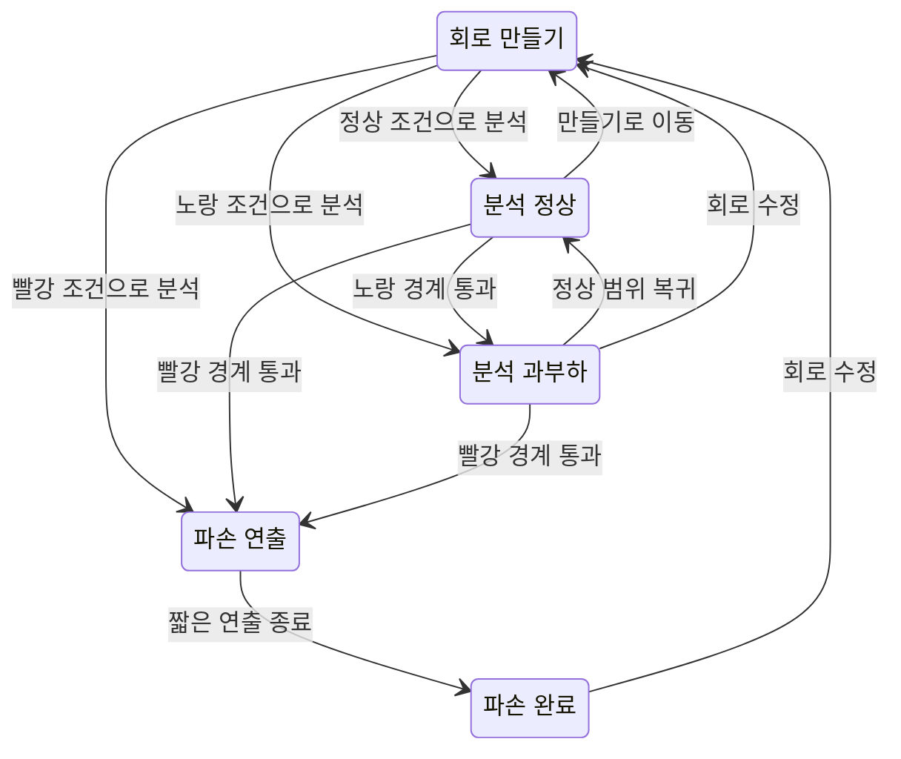

# 다이오드 회로의 경고·분석·수정 경험

상태: [ADR-026](../../decisions/ADR-026-diode-boundary-analysis.md)의 확정 설계, 구현 전.

기존 **회로 만들기 / 분석하기 / 회로도 출력**을 유지한다. 여기서 측정은 분석하기 안의 도구이며 별도 확정 단계가 아니다. 전기 조건과 색상 판정은 [작동 경계](../physics/circuit-operating-boundaries.md)를 따른다.

## 1. 경험의 기준

- 만들기는 조립 중인 회로다. 분석 진입 전에는 과부하·파열·손상을 연출하지 않는다.
- 분석 진입은 현재 구조와 부품 조건으로 실험을 시작하는 시점이다. 별도 확인 모달을 추가하지 않는다.
- 학생은 같은 회로에서 작동·과부하·파손의 차이를 관찰한다. 내부 해석 상태나 긴 설명문을 읽어야 진행되는 흐름을 만들지 않는다.
- 열 적분·냉각·온도 수치 없이 현재 작동점의 경계 사건을 짧게 표현한다.
- 연출 후에는 화면 구석에 작은 `회로 수정` 버튼을 두어 만들기로 돌아갈 수 있게 한다.

## 2. 만들기의 사전 경고

현재 확정된 회로 리비전과 부품 값에 대해 **지금 분석하기로 들어갈 경우**를 계산한다. 배선 중인 선의 미리보기, 미확정 숫자 초안, 과거 리비전의 계산 결과는 판정에 사용하지 않는다.

| 사전 평가 | 캔버스 왼쪽 위 |
|---|---|
| 정상 | 위험 느낌표 없음 |
| 과부하 예상 | 노란 느낌표 |
| 파손 예상 | 빨간 느낌표 |
| 아직 검증되지 않은 결과 | 노랑·빨강을 임의 생성하지 않음. 기존 중립 진단 경로 사용 |

기존 진단 아이콘의 위치·클릭/탭·키보드·닫기 동작을 재사용한다. 위험 표시는 하나이며 가장 높은 수준을 대표한다. 색 외에도 느낌표·접근성 이름으로 상태를 구별한다.

아이콘을 누르면 관련 부품을 가볍게 강조하고 한 개의 짧은 주의사항만 보여준다. 여러 원인이 있어도 설명문을 누적하지 않는다. 필요하면 관련 부품을 눌러 해당 원인을 확인한다.

다음은 그 자체로 노랑·빨강 위험이 아니다.

- 빈 회로, 전원 없음, 열린 스위치, 미연결 단자.
- 전위 기준이 없는 부분이나 이상 도선 고리의 미정 전류.
- 가변저항 범위의 다른 값에서 생길 수 있는 문제.
- 계산 예산 초과·검증 미완료.

독립된 미완성 부분이 있어도 다른 곳에 확인된 위험한 폐회로가 있으면 그 위험은 표시한다. 기존 정보 진단의 상세 설명과 물리적 위험 색상을 혼동하지 않는다.

## 3. 상태와 전이

| 상태 | 화면 | 허용되는 행동 |
|---|---|---|
| 만들기 | 온전한 제작 회로, 필요할 때만 사전 느낌표 | 기존 편집·저장·출력 |
| 분석 정상 | 기존 전위·전류·측정 | 측정·기록·허용된 전기값 수정 |
| 분석 과부하 | 작동 중인 흐름과 관련 부품의 과부하 표현 | 측정·기록·수동 값 조절, 회로 수정 |
| 분석 파손 연출 | 대상 부품의 짧은 파열 | 값 변경·새 기록·자동 조절 잠금 |
| 분석 파손 완료 | 손상된 부품, 짧은 원인, 회로 수정 | 화면 이동·원인 확인·만들기 복귀 |

### 분석 진입

현재 리비전의 검증된 사전 평가가 있으면 재사용하고 없으면 같은 입력과 프로필로 평가한다. 회로가 확정되었다고 가정한 판정을 적용한 뒤 정상·노랑·빨강 상태로 진입한다.

분석 중 구조 변경 금지는 기존 명령 검사에서 유지한다. 전기값 수정은 정상·노랑에서 허용한다. 이전 회로의 비동기 응답이 새 회로에 사건을 발생시키지 않도록 리비전과 분석 세션 ID를 검사한다.

### 노랑: 작동 중인 과부하

- 검증된 유한 전류와 단자전압으로 회로를 계속 표현한다.
- 해당 부품에 짧은 진입 강조 후 과부하 표식을 유지한다. 몸체 바깥의 테두리·국소 효과로 전위 색과 구별한다.
- 필요할 때 부품 근처에 `과부하`만 표시한다. 긴 패널·토스트·수정 지시를 띄우지 않는다.
- 실제 온도·열 축적·고장까지의 시간을 표시하지 않는다.
- 수동 가변저항을 정상 범위로 되돌리면 과부하 표현을 바로 해제한다. 냉각 상태는 없다.
- 작동 중 측정·기록은 계속 가능하다. 구석의 `회로 수정`도 사용할 수 있다.

### 빨강: 파열 후 파손

- 빨강 판정이 확정된 부품에서 한 번의 짧은 파열 효과를 재생하고 손상된 모습으로 끝낸다.
- 처음부터 빨강이면 노랑 장면을 의무적으로 거치지 않는다.
- 여러 부품이 동시에 빨강이면 관련 대상을 함께 표시하고 긴 순차 폭발을 만들지 않는다.
- 큰 화면 흔들기·반복 섬광·점수·폭죽 보상은 사용하지 않는다. 효과는 관련 부품 주변에 한정한다.
- 원인은 부품 근처의 짧은 오버레이 또는 클릭/탭 툴팁 한 곳에서 제공한다.
- 실제 부품의 즉시 파손 시점·고장 형태를 재현하는 것으로 설명하지 않는다.

연출 길이는 UI 상수로 둔다. 초기 기준은 노랑 진입 효과 약 250 ms, 빨강 파열 약 500 ms이며 사용자 확인에서 조절할 수 있다. 이 숫자는 회로 계산·위험 임계·기록 시간에 영향을 주지 않는다.

## 4. 가변저항과 임계 사건

기존 슬라이더·직접 숫자 입력·자동 왕복의 유효 값 적용 경로에 경계 판정을 연결한다. 범위·단위·권한·문서 검증은 기존 경로를 재사용한다.

| 전이 | 처리 |
|---|---|
| 정상 → 노랑 | 과부하 진입 효과 1회, 자동 왕복 정지, 수동 조절 유지 |
| 정상 → 빨강 | 파손 효과 1회, 자동 왕복과 전기값 변경 잠금 |
| 노랑 → 빨강 | 파손으로 1회 승격 |
| 노랑 → 정상 | 과부하 표현 해제, 다음 진입 허용 |
| 같은 상태 유지 | 숫자·흐름만 갱신, 진입 효과 반복 금지 |
| 빨강 이후 | 값만 되돌려 복구하지 않음. 회로 수정으로 세션 종료 |

반올림된 숫자, 스크롤·카메라·탐침 이동, 소자 선택, 창 숨김/표시, React 재렌더는 위험 진입이 아니다. 새로 노랑이 된 개별 부품의 국소 상태는 갱신하되 이미 표시한 같은 부품·원인의 효과를 매 프레임 반복하지 않는다.

자동 왕복은 첫 위험을 관찰한 현재값에서 멈춘다. 노랑에서 사용자가 다시 재생을 선택하면 이어갈 수 있고 빨강으로 승격되는 순간에는 다시 잠근다. 자동 조절의 숨겨진 컨트롤도 같은 사건을 받아 멈춘다.

매개변수 사건은 실제로 적용한 유효한 값에서 판단한다. 존재하지 않은 중간 보간값의 파손을 꾸며내지 않는다. 자동 왕복이 0~1000의 이산 슬라이더 위치를 건너뛸 때는 진행 경로의 적용 대상 위치를 순서대로 확인해 첫 위험에서 멈춘다. 처리 예산을 넘으면 진행을 잠시 멈춰 다음 유효 표본을 확인하며, 미검사 위치를 안전하다고 가정하여 건너뛰지 않는다. 여러 자동 조절기의 입력은 같은 결정론적 순서로 처리한다.

빨강 사건을 확정할 때 세션 상태와 마지막 전기값을 원자적으로 고정한다. 같은 드래그에서 늦게 도착한 값·Undo·Redo가 파손 상태를 정상으로 덮어쓰지 못하게 명령 경계에서 검사한다.

현재의 **전류 흐름 일시정지**는 화면 무늬만 멈춘다. 이 버튼으로 위험 판정이나 가변저항 경계 사건을 막지 않는다.

## 5. 파손 후의 측정과 수정 복귀

첫 버전은 파손 이후 개방·단락 회로를 재해석하지 않는다. 파손은 분석 세션의 종료 사건이다.

- 파손 연출이 시작되면 흐름 애니메이션·자동 조절·새 측정 기록을 멈춘다.
- 파손 완료 뒤 실시간 계기는 `—`로 바꾸며 임의의 0 A·0 V를 표시하지 않는다.
- 현재값인 것처럼 남은 전위 숫자·전위색·3D 높이도 중단한다. 기본 회로와 손상 표시는 유지하고 3D에서는 바닥 회로를 남긴다.
- 필요하면 내부 사건 스냅샷에 직전 값과 원인을 보존한다. 이를 보여줄 경우 반드시 `파손 직전`으로 구별한다. 기본 화면에 새로운 상세 수치 패널은 추가하지 않는다.
- 이전에 사용자가 기록한 측정표는 그대로 남긴다. 파손 사건 자체를 자동으로 새 측정 행으로 저장하지 않는다.

`회로 수정`은 기존 만들기 전환을 재사용한다. 데스크톱·모바일 모두 캔버스 하단의 빈 구석에 두되 기존 오른쪽 아래 확대/축소·모바일 공용 바·기록창과 겹치지 않게 배치한다. 화면 중앙을 막는 필수 버튼이나 모달로 만들지 않는다.

복귀 시 다음을 유지한다.

- 회로 구조, 부품 이름, 마지막으로 적용된 저항값.
- 가능한 범위의 화면 위치·선택, 기존 측정 기록.
- 전기 조건이 바뀌지 않았다면 같은 사전 경고.

다음은 초기화한다.

- 파손 표시와 연출 진행률, 사건 재생 방지 상태.
- 분석 세션의 값 변경 잠금·자동 조절 실행 상태.

제작 원본은 온전한 부품으로 보인다. 회로를 바꾸지 않고 다시 분석하면 같은 문제가 다시 발생한다. 자동으로 저항을 추가하거나 안전한 값으로 고치지 않는다.

## 6. 최소 문구

규칙: 원인별 한 줄, 최대 한 문장. 기본 팝업은 두 줄을 넘기지 않고 해결 절차·수식·내부 코드를 추가하지 않는다. 부품 이름은 저장 ID가 아니라 회로에 보이는 이름을 사용한다.

| 상황 | 문구 기준 |
|---|---|
| 만들기 노랑 | `분석하면 D₁에 과부하가 걸려요` |
| 만들기 빨강 | `분석하면 D₁이 손상돼요` |
| 과도한 순방향 전류 | `흐르는 전류가 너무 커요` |
| 과도한 소비전력 | `감당할 수 있는 전력을 넘었어요` |
| 역전압 | `역방향 전압이 너무 커요` |
| 파손 부품 | `전류가 너무 커서 손상됐어요` 등 확인된 주원인 1개 |
| 수정 행동 | `회로 수정` |
| 부품 모델 표시 | `부품 특성` |

`해 없음`, `특이 행렬`, `수렴 실패`, `전류 미정`을 위험 원인 문구로 사용하지 않는다. 정상 차단·미완성 회로에 위험 문구를 붙이지 않는다. Ω 측정의 미지원 안내는 일반 측정 안내이며 위험 사건과 분리한다.

## 7. 접근성·출력·기록 보기

- 아이콘은 색 외의 느낌표·접근성 이름을 갖는다. 키보드와 탭으로 원인을 확인할 수 있다.
- 위험 발생은 사건당 한 번만 보조기술에 알린다. 연출 프레임마다 알리지 않는다.
- 동작 줄이기 설정에서는 파열 이동·섬광을 생략하고 최종 과부하/파손 상태와 짧은 원인을 즉시 표시한다.
- 팝업 닫기와 초점 복귀는 기존 진단 팝업을 재사용한다. 과부하만으로 입력 초점을 빼앗지 않는다.
- 문제지 출력은 온전한 `CircuitDocument`와 공통 기호로 생성한다. 위험 아이콘·파손 모습·부품 원인 툴팁은 출력하지 않는다.
- 과거 측정의 회로 보기, 인쇄 미리보기, 사전 계산, 등가저항의 가상 시험은 현재 분석 사건을 재생하지 않는다.

검증 목록은 [수용 사례의 UX 표](../testing/diode-cases.md)를 따른다.
