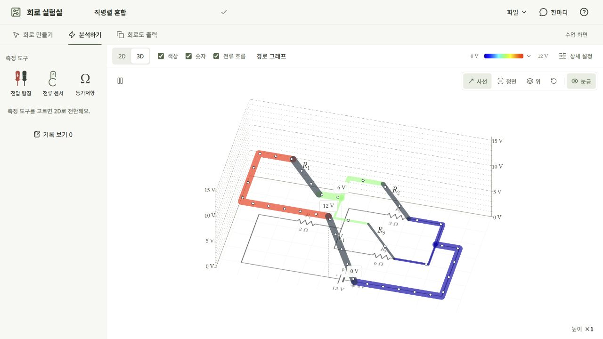
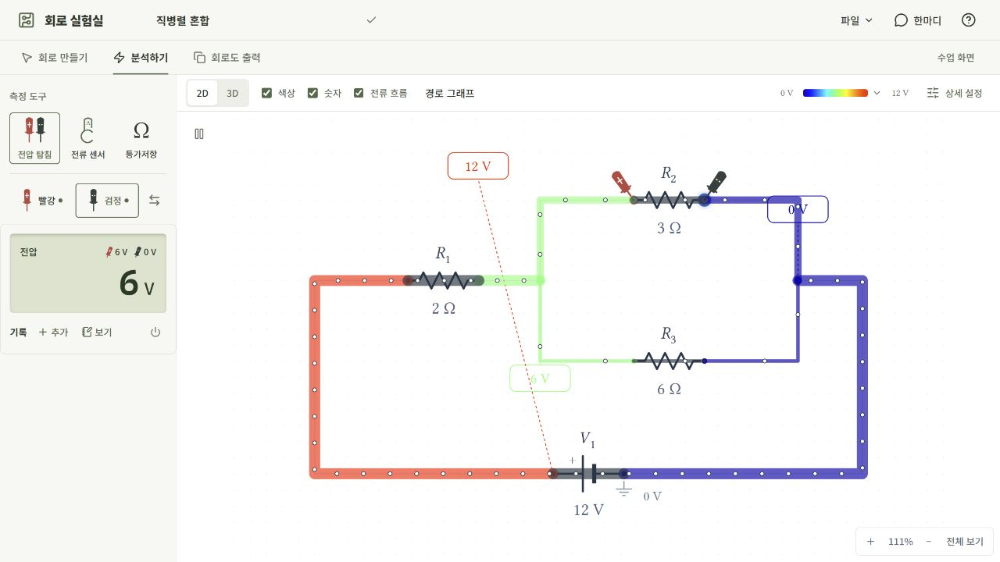
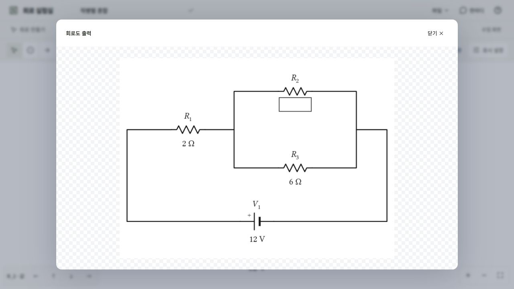

# 회로 실험실 사용 설명서

회로를 처음 연결하는 순간부터 측정 결과를 비교하고 활동지에 그림을 넣기까지, 필요한 순서대로 안내합니다. 처음이라면 **첫 회로 살펴보기**부터 따라 해 보세요. 이미 사용 중이라면 아래에서 궁금한 항목으로 바로 이동할 수 있습니다.

[회로 실험실 열기](https://cho-wh.github.io/circuit/) · [소개로 돌아가기](../../README.md)

| 시작과 편집                        | 관찰과 측정                            | 정리와 활용                     |
| :--------------------------------- | :------------------------------------- | :------------------------------ |
| [첫 회로 살펴보기](#first-circuit) | [전위와 전류 보기](#analysis)          | [회로도 출력](#worksheet)       |
| [부품 배치와 편집](#components)    | [측정 도구 사용하기](#measurement)     | [저장과 파일 옮기기](#saving)   |
| [도선 연결하기](#wiring)           | [계기·스위치·가변저항](#live-controls) | [터치 조작과 단축키](#controls) |
| [선택·복사·접지](#selection)       | [측정 기록 남기기](#records)           | [궁금한 점과 피드백](#help)     |

## 1. 첫 회로 살펴보기

별도의 설치나 회원가입 없이 [앱](https://cho-wh.github.io/circuit/)을 열면 됩니다. 처음 나타나는 안내창을 닫아도 상단 물음표에서 다시 볼 수 있습니다.

### 예제로 시작하기

1. **회로 만들기**의 왼쪽에서 **예제 회로 → 직렬**을 선택합니다. 휴대전화에서는 **+ 부품 → 예제 회로**를 엽니다.
2. **분석하기**를 누릅니다. 전원과 두 저항을 잇는 도선의 색과 전위 숫자를 살펴봅니다.
3. **3D**를 누릅니다. 전위를 높이로 나타낸 회로가 보입니다. 화면을 끌어 다른 방향에서 보고, **보기 초기화**로 돌아올 수 있습니다.
4. **전압 탐침**을 선택합니다. 화면이 2D로 돌아오면 한 저항의 양쪽 단자를 차례로 누릅니다.
5. 측정값을 확인하고 **두 탐침 맞바꾸기**를 눌러 부호가 어떻게 달라지는지 비교합니다.

익숙해지면 **가변저항 (직렬)**이나 **브릿지 정류 회로**를 열어 보세요. 저항값이나 스위치 상태를 바꾸며 같은 회로에서 여러 조건을 비교할 수 있습니다.

### 세 화면의 역할

| 화면            | 여기서 할 수 있는 일                                              |
| :-------------- | :---------------------------------------------------------------- |
| **회로 만들기** | 부품 배치, 배선, 이름·값 수정, 이동·회전·복사·삭제                |
| **분석하기**    | 전위·전류 관찰, 탐침·센서 측정, 스위치·가변저항 조작, 측정 기록   |
| **회로도 출력** | 표기 숨김·빈칸, 이름·값 위치 조정, 점·화살표·글자, 그림 복사·저장 |

세 화면은 같은 회로를 사용합니다. 회로의 연결 구조를 바꾸려면 **회로 만들기**로 돌아오세요. 넓은 화면의 **수업 화면**은 주변 패널을 접어 회로를 크게 보여 줍니다. **편집 화면**으로 돌아오면 도구가 다시 나타납니다.

## 2. 부품 배치와 편집

### 새 회로에 부품 놓기

**빈 회로 만들기** 또는 **파일 → 새 회로**로 시작합니다. 휴대전화에서는 상단 **⋯ → 새 회로**를 사용합니다.

부품 목록에서 원하는 부품을 고른 뒤 회로 화면의 놓을 곳을 누릅니다. 휴대전화에서는 **+ 부품**을 먼저 누르세요. 넓은 터치 화면의 부품 목록에서는 길게 눌러 끌어올 수도 있습니다.

| 부품            | 쓰임새                                                                           |
| :-------------- | :------------------------------------------------------------------------------- |
| 전지 | 설정한 전압을 유지합니다. |
| 직류 전원 | 분석 중 전압을 조절하며 측정값의 변화를 관찰합니다. |
| 저항 · 가변저항 | 저항값에 따른 전압과 전류의 변화를 살펴봅니다.                                   |
| 스위치          | 회로를 열거나 닫습니다.                                                          |
| 전환 스위치     | 공통 접점을 A 또는 B 쪽으로 연결합니다.                                          |
| 다이오드        | 연결 방향에 따른 전류의 차이를 살펴봅니다. 신호용·대전류용을 선택할 수 있습니다. |
| 전류계 · 전압계 | 계기를 직접 연결하고 여러 위치의 값을 함께 관찰합니다.                           |

### 이름과 값 바꾸기

부품 옆 이름이나 값을 누르거나, 부품을 선택한 뒤 **이름·값**을 누릅니다. **적용** 또는 Enter로 확정하고, **취소** 또는 Esc로 이전 상태를 유지합니다.

- 저항값에는 `10`, `1k`, `1.5 kΩ`, `3/4 kΩ`처럼 입력할 수 있습니다.
- 이름에 `R_1`, `R_{eq}`를 쓰면 밑줄 뒤 부분이 아래첨자로 표시됩니다.
- 새 부품에는 종류에 맞는 이름이 자동으로 붙습니다. 원하는 이름으로 바꿔도 됩니다.
- 다이오드는 값 대신 **신호용 / 대전류용**을 선택합니다. 종류 변경은 **회로 만들기**에서 합니다.

숫자 모양을 바꾸려면 부품을 선택하고 **상세 설정**에서 **자동 단위 / 유효 숫자 / 원래 숫자**를 고릅니다. 유효 숫자는 네 자리로, 원래 숫자는 접두어 없는 기본 단위로 표시합니다. **전체 적용**은 같은 표시 방식을 모든 부품에 적용합니다. 표시 방식은 실제 회로값을 바꾸지 않습니다.

### 이동·회전·삭제

부품을 선택해 끌면 위치가 바뀌고 연결된 도선의 가까운 부분이 따라 조정됩니다. 여러 부품을 함께 선택해 옮길 수도 있습니다.

**회전**은 부품만 90도 돌립니다. 도선은 원래 자리에 남아 연결이 떨어지며, 두 단자 부품을 두 번 돌려 180도가 되면 원래 도선 끝에 역방향으로 다시 연결됩니다. 단자와 연결점이 정확히 맞는 경우에만 연결되며, 같은 위치에 후보가 겹치면 자동으로 합치지 않습니다.

**삭제**는 연결된 두 단자 부품의 자리를 도선으로 이어 줍니다. 전압계와 열린 스위치도 같은 방식으로 삭제됩니다. 전환 스위치의 세 접점은 서로 이어 붙이지 않습니다. 배선까지 없애려면 해당 도선도 선택해 삭제하세요. 잘못 지웠다면 **실행 취소**로 되돌릴 수 있습니다.

## 3. 도선 연결하기

### 단자끼리 잇기

1. 출발할 단자를 누릅니다.
2. 곧바로 연결하려면 도착 단자를 누릅니다.
3. 꺾이는 경로가 필요하면 중간의 빈 곳을 차례로 눌러 경로를 고정한 뒤 도착 단자나 도선에서 마칩니다.

도선은 가로·세로로 그려집니다. **방향 전환** 또는 `/`로 마지막 구간의 꺾이는 방향을 바꾸고, **되돌리기** 또는 Backspace로 마지막 고정점을 지울 수 있습니다. Esc나 취소 버튼은 진행 중인 배선 전체를 취소합니다.

### 빈 공간에서 시작하거나, 끝을 열어 두기

상단 **배선** 도구를 직접 선택하면 단자가 없는 빈 공간에서도 시작할 수 있습니다. 경로를 그린 뒤 **마지막 고정점을 한 번 더 누르면 그 지점까지 확정**됩니다. 열린 끝은 나중에 이어서 연결하면 됩니다.

### 가지와 교차점

도선을 선택하고 원하는 위치의 반투명 가지 표시를 누르면 그곳에서 새 배선을 시작할 수 있습니다. 터치에서는 후보 위치를 고른 뒤 체크 버튼이나 같은 후보를 다시 눌러 확정합니다. 도착점이 도선인 경우도 같은 방식입니다.

두 도선은 겹쳐 보이는 것만으로 연결되지 않습니다. **아치 모양은 비연결**, **채워진 점은 연결**입니다. 비연결 교차점을 누르면 연결할 수 있고, 네 갈래 직교 교차는 다시 눌러 분리할 수 있습니다. T자 분기나 접지·주석이 붙은 점 등은 같은 방식으로 분리하지 않습니다.

### 도선 모양 다듬기와 부품 삽입

선택한 도선의 사각 손잡이를 끌면 해당 구간을 옮길 수 있습니다. 방향키로 조금씩 움직이는 것도 가능합니다.

새 두 단자 부품을 충분히 긴 직선 도선 위에 놓으면 그 자리에 삽입할 수 있습니다. 미리보기에서 기호와 양쪽 연결을 확인하세요. 터치에서는 **삽입**으로 확정합니다. 전환 스위치는 이 방식으로 삽입하지 않습니다.

전압계도 도선 중간에 넣을 수 있지만, 이상적인 전압계를 직렬로 넣으면 그 경로에는 전류가 흐르지 않습니다. 두 점 사이의 전압을 측정하려면 두 점에 병렬로 연결하세요.

분기점은 배선을 편집하면 필요한 만큼 정리됩니다. 점 자체를 지우기보다 연결된 도선을 수정하거나 삭제하세요. 실제 가지와 열린 끝은 유지됩니다.

## 4. 선택·복사·접지

### 여러 요소를 함께 선택하고 복사하기

**선택** 도구에서 빈 곳부터 끌어 회로를 상자로 감싸면 여러 요소가 선택됩니다. Shift+클릭으로 선택을 더할 수도 있습니다.

선택한 뒤 상단 **복사**를 누릅니다. 마우스에서는 반투명 미리보기를 움직여 클릭으로 놓고, 터치에서는 놓을 위치를 탭한 뒤 **붙여넣기**를 누릅니다. 확정 전 다른 위치를 탭하면 미리보기를 옮길 수 있습니다. Esc로 취소합니다.

복사본에는 새로운 부품 이름이 붙으며 원래 회로와 자동으로 연결되지 않습니다. 여러 요소를 한꺼번에 복사할 때는 기존 부품과 겹치지 않는 곳에 놓으세요.

### 접지 표시하기·옮기기·지우기

접지를 따로 놓지 않아도 회로를 만들고 분석할 수 있습니다. 회로도에 표시하고 싶다면 **접지** 도구로 단자나 도선을 선택하세요. 작은 화면에서는 편집 도구의 **⋯ → 접지 지정**을 사용합니다.

놓인 접지 기호를 선택하면 삭제할 수 있고, 기호를 끌어 다른 단자나 도선으로 옮길 수도 있습니다. 접지를 옮겨도 도선은 따라오지 않습니다. 도선 위에 놓으면 그 위치에 연결점이 생깁니다.

서로 떨어진 회로를 같은 화면에서 각각 분석할 수 있습니다. 다만 전기적으로 연결되지 않은 회로 사이의 전압은 비교할 수 없습니다.

## 5. 전위와 전류 보기

**분석하기**에서는 **색상·숫자·전류 흐름**을 따로 켜고 끕니다. 처음에는 숫자와 색상으로 회로를 익힌 뒤 전류 흐름을 더해 보세요.

### 색상과 숫자

같은 도선으로 이어진 지점은 같은 전위입니다. 단자나 도선을 누르면 함께 연결된 부분이 강조됩니다. 위쪽 색상바를 누르면 **파랑 → 노랑 / 전체 스펙트럼 / 검붉은색 → 노랑** 중에서 고를 수 있습니다.

색은 표시 범위에 따라 달라집니다. 서로 다른 실험을 색으로 비교할 때는 같은 색상표와 같은 전압 범위를 사용하고 숫자도 함께 확인하세요.

### 전류 흐름

띠의 방향은 전류 방향을, 두께와 무늬 간격은 전류의 크기 차이를 보여 줍니다. **무늬의 이동 속도가 실제 전자의 속도를 뜻하지는 않습니다.** 회로에 맞춰 표현 크기가 자동 조정되므로 정확한 값은 센서나 계기로 확인하세요.

2D에서는 전류가 작거나 흐르지 않는 부분도 연결을 살펴볼 수 있도록 원래 도선이 희미하게 남습니다. 부품 기호는 진하게 유지됩니다. **상세 설정 → 전류 두께**로 표현을 조절하고 화면 왼쪽 위 버튼으로 흐름을 일시 정지할 수 있습니다.

### 3D와 경로 그래프

**3D**는 전위가 높은 곳을 높게, 낮은 곳을 낮게 보여 줍니다. 화면을 끌어 시점을 돌리거나 **사선 / 정면 / 위**를 고르세요. **보기 초기화**로 기본 시점에 돌아옵니다. 높이 배율과 눈금으로 보기 편하게 조절할 수 있습니다.

전압 탐침을 2D에 놓고 3D로 전환하면 두 점의 높이 차와 측정값을 함께 볼 수 있습니다. 넓은 화면의 **경로 그래프**에서는 회로를 따라 전위가 어떻게 변하는지도 살펴봅니다.

## 6. 측정 도구 사용하기

넓은 화면에서는 분석 화면 왼쪽에서 도구를 고릅니다. 휴대전화에서는 **측정**을 눌러 측정 도구 모음으로 전환합니다. 3D에서 도구를 선택하면 탐침이나 센서를 놓을 수 있도록 2D로 돌아옵니다.

### 전압 탐침

**전압 탐침**을 고른 뒤 두 단자나 도선을 차례로 누르면 빨강·검정 탐침이 놓입니다. 표시값은 **빨강 지점의 전위 − 검정 지점의 전위**입니다. 음수는 탐침 방향에 따른 결과이며, **두 탐침 맞바꾸기**로 비교할 수 있습니다.

탐침 선택 버튼으로 옮길 탐침을 고른 뒤 다른 지점을 누르거나, 회로에 놓인 탐침을 끌어 옮깁니다. 작은 빨강·검정 숫자는 각 지점의 전위이고 큰 디스플레이 숫자는 두 지점 사이의 전압입니다.

### 전류 센서

**전류 센서**를 고르고 부품이나 도선 구간을 누릅니다. 디스플레이에서 크기를, 센서 옆 화살표에서 방향을 확인합니다. 센서를 끌어 다른 곳의 전류를 비교할 수 있습니다. 측정을 위해 도선을 끊거나 회로 연결을 바꿀 필요는 없습니다.

### 등가저항

**등가저항 → 전원 분리하고 측정**을 누른 뒤 두 탐침을 놓습니다. 전원은 잠시 흐려지고 측정 중에는 회로에서 분리됩니다. 전원이 없는 회로는 바로 측정합니다.

**도구 종료** 또는 Esc로 끝내면 원래 회로와 보기 설정으로 돌아옵니다. 휴대전화에서는 **뒤로**를 누르면 됩니다. 이 과정은 원래 배선을 바꾸지 않습니다. 다이오드가 포함된 측정 부분의 등가저항은 현재 지원하지 않습니다.

### 측정값을 읽을 때

`0`은 측정된 값이 0이라는 뜻입니다. `—`는 탐침이 아직 연결되지 않았거나 값을 정할 수 없는 상태입니다. 둘을 구분해 읽어 주세요. 서로 떨어진 회로 사이의 전압이나 분석이 중단된 상태에서도 값을 확정하지 않습니다. `≈`가 붙은 값은 근삿값입니다.

전압 탐침은 3D에서도 관찰할 수 있지만, 전류 센서와 등가저항 도구는 3D로 전환하면 종료됩니다. 탐침을 새로 놓거나 옮기는 조작은 2D에서 합니다.

## 7. 계기·스위치·가변저항으로 비교하기

### 회로에 놓은 전류계와 전압계

전류계는 측정할 가지에 **직렬로**, 전압계는 비교할 두 지점에 **병렬로** 연결합니다. 계기 기호의 **+ / −**는 표시값을 읽는 방향입니다. 전압계는 + 쪽에서 − 쪽의 전위를 뺀 값을, 전류계는 + 단자로 들어가는 전류를 양수로 표시합니다.

분석 모드에서 기호 오른쪽 위의 **⊕**를 누르면 작은 측정창이 열립니다. 여러 계기의 창을 동시에 열어 비교할 수 있고, 다른 곳을 눌러도 닫히지 않습니다. 접으려면 해당 창의 **⊖**를 누르세요. 회로 조건이 바뀌면 값도 함께 갱신됩니다.

### 스위치와 전환 스위치

분석 중 스위치를 선택하면 왼쪽에 조작부가 나타납니다. 측정 도구를 사용하면서도 회로를 열고 닫거나 전환 스위치의 A·B 연결을 바꿀 수 있습니다. 작은 화면에서는 조작부가 회로 아래쪽에 나타납니다.

**브릿지 정류 회로**에서는 스위치를 바꾼 뒤 가운데 저항의 전류 방향을 비교해 보세요. 어느 다이오드를 거쳐 흐르는지도 함께 살펴볼 수 있습니다.

### 가변저항·직류 전원

가변저항은 저항값을, 직류 전원은 전압을 조절합니다. 분석 중 회로에서 해당 부품을 선택하면 왼쪽에 숫자 입력과 슬라이더가 나타납니다. 탐침이나 계기창을 열어 둔 채 조절하면 값의 변화를 바로 비교하기 좋습니다. 조절 범위는 **회로 만들기**에서 해당 부품의 상세 설정으로 정합니다.

## 8. 측정 기록 남기기

측정값 아래 **기록 · + 추가**를 눌러 현재 값을 남기고, **보기**로 측정표를 엽니다. 도구를 닫은 뒤에는 **기록 보기**를 사용합니다. 휴대전화에서는 측정 도구의 **⋯ → 측정값 기록 / 기록 보기**로 들어갑니다.

기록은 당시의 회로와 측정 조건을 담습니다. 이후 저항값을 바꾸어도 앞서 기록한 값은 그대로 남아 비교할 수 있습니다. 행별 메모를 수정하거나 기록을 삭제할 수 있고, 위치 이름을 누르면 **기록 당시 회로**를 확인할 수 있습니다.

**전체 삭제**는 짧은 확인 후 실행됩니다. 개별·전체 삭제 모두 측정표의 **되돌리기**로 마지막 삭제를 복구할 수 있습니다. 새로 추가한 기록과 메모는 유지되며, 복구 기능은 새로고침 전까지 사용할 수 있습니다. 회로 편집의 Ctrl+Z와는 별개입니다. 다이오드 종류도 기록 당시 조건으로 표시되며 표 복사·CSV에 함께 들어갑니다.

활동지에는 **표 복사**, 파일로 보관할 때는 **CSV 저장**을 이용하세요. 측정 기록은 현재 브라우저에 저장되며 회로 JSON 파일에는 포함되지 않습니다.

## 9. 회로도를 수업 자료로 내보내기

**회로도 출력**으로 전환합니다. 휴대전화에서는 상단 **⋯ → 회로도 출력**을 엽니다. 넓은 화면에서는 표기와 주석을 편집할 수 있고, 작은 화면에서는 완성된 그림을 확인하고 복사·저장할 수 있습니다.

### 이름·값·빈칸 다듬기

부품의 이름이나 값을 누르면 **표시 설정**이 열립니다. 이름과 값을 각각 숨기거나 **빈칸 □**으로 바꾸세요. 글자를 끌어 위치를 바꾸고 **글자 크기 배율**로 크기를 조절할 수 있습니다.

이름을 고치면 회로 전체의 실제 부품 이름도 바뀝니다. 반면 출력의 값은 읽기 전용입니다. 저항값이나 전압 자체를 바꾸려면 **회로 만들기**로 돌아갑니다. 출력에서 숨기거나 빈칸으로 바꾸어도 계산값은 달라지지 않습니다.

**점 / 전류 화살표 / 직각 전류 화살표 / 글자**로 필요한 설명을 더할 수 있습니다. 추가한 화살표는 위치·길이·방향과 문구를 조절할 수 있습니다.

### 처음에는 숨겨지는 표기

| 표기                  | 켜는 곳                                   |
| :-------------------- | :---------------------------------------- |
| 접지 기호             | **표시 설정 → 그림 설정 → 접지 표시**     |
| 전지의 +, 전류계·전압계의 +/− | **표시 설정 → 그림 설정 → 기호 +/− 표시** |
| 다이오드 종류         | 해당 부품의 **종류 표시**                 |
| 일반·전환 스위치 상태 | 해당 부품의 **상태 표시**                 |

접지는 출력에서 기호만 나타나며 0 V 글자는 붙지 않습니다. 부품 이름은 위 표기와 별도로 설정합니다.

### 복사와 파일 저장

- **그림 복사**: PNG 그림을 복사해 문서나 슬라이드에 붙여 넣습니다. 브라우저가 복사를 지원하지 않으면 PNG 파일로 저장합니다.
- **파일 저장 → SVG 저장**: 확대해도 선명한 벡터 그림을 저장합니다.
- **파일 저장 → PNG 저장**: 여러 문서 프로그램에서 바로 사용하기 좋은 이미지로 저장합니다.
- **그림 설정 → 투명 배경 / 고해상도 출력**: 배경을 없애거나 PNG의 가로·세로 해상도를 각각 두 배로 높입니다.

넓은 화면의 **미리보기**에서 실제 출력 모습을 확인할 수 있습니다. 선택 테두리와 편집 도구는 저장되는 그림에 포함되지 않습니다.

## 10. 저장하고 다른 기기로 옮기기

작업은 현재 브라우저에 자동 저장됩니다. 상단의 **이 브라우저에 저장됨** 표시로 확인하세요. 중요한 회로는 **파일 → 회로 파일 저장**으로 별도 파일도 남겨 두는 것이 좋습니다.

저장된 회로를 열지 못하면 **새 회로로 시작·복원·백업** 중에서 선택합니다. 복원이 실패하면 새 회로와 백업을 선택할 수 있습니다. 백업은 원본 파일을 내려받는 기능입니다. 새 회로를 시작해도 보관된 원본은 **파일 → 원본 백업 저장**에서 다시 받을 수 있습니다.

| 하려는 일                   | 사용할 기능                                                     |
| :-------------------------- | :-------------------------------------------------------------- |
| 같은 브라우저에서 이어 하기 | 마지막 자동 저장 회로를 복원합니다.                             |
| 회로를 다른 기기로 옮기기   | JSON으로 **회로 파일 저장** 후 다른 기기에서 **회로 파일 열기** |
| 실험 전 상태를 따로 남기기  | **현재 회로 보관**, 필요할 때 **보관한 회로 불러오기**          |
| 측정값과 메모 가져가기      | 측정표의 **표 복사 / CSV 저장**                                 |
| 회로 그림을 자료에 넣기     | 출력 화면의 **그림 복사 / SVG·PNG 저장**                        |

회로 파일에는 부품·배선·출력 표기가 들어갑니다. **측정 기록과 실행 취소 이력은 함께 옮겨지지 않습니다.** 새로고침하면 저장된 회로와 측정 기록은 복원되지만 실행 취소 이력은 초기화됩니다. 예제나 새 회로를 여는 것만으로 기존 측정 기록이 지워지지는 않습니다.

사이트 데이터를 지우거나 다른 브라우저를 사용하면 자동 저장 자료를 그대로 불러올 수 없습니다. 앱이 지원하지 않는 이전 형식의 파일은 열리지 않을 수 있습니다. 시험용 개발판을 별도로 사용하는 경우에도 저장 공간이 구분되므로 회로 파일로 옮겨 주세요.

## 11. 터치 조작과 단축키

### 마우스와 터치

| 조작           | 마우스                                | 터치                                             |
| :------------- | :------------------------------------ | :----------------------------------------------- |
| 부품 놓기      | 부품 선택 후 위치 클릭                | **+ 부품**에서 선택 후 위치 탭                   |
| 부품 옮기기    | 선택한 부품 끌기                      | 선택 후 끌기, 또는 미선택 부품 길게 누른 뒤 끌기 |
| 여러 요소 선택 | **선택** 도구로 빈 곳부터 상자 그리기 | 같은 방법으로 상자 그리기                        |
| 화면 이동      | 만들기에서는 가운데 버튼으로 끌기     | 두 손가락으로 끌기                               |
| 확대·축소      | 마우스 휠 또는 화면 버튼              | 두 손가락 벌리기·오므리기 또는 화면 버튼         |
| 복사본 놓기    | 미리보기를 움직여 클릭                | 위치 탭 후 **붙여넣기**                          |

2D에서는 마우스가 가리키는 곳을 기준으로 확대됩니다. 화면을 잃어버린 것 같으면 **전체 보기**, 출력에서는 **출력 전체 맞춤**을 사용하세요. 3D에서는 끌기로 시점을 회전합니다.

미선택 부품 위를 터치로 짧게 밀면 화면 이동으로 처리됩니다. 부품을 옮기려면 먼저 선택하거나 길게 눌러 집으세요. 편집 중 두 번째 손가락을 대면 진행 중인 이동을 취소하고 화면 이동·확대로 전환합니다.

### 휴대전화의 도구 위치

- 부품과 예제는 **+ 부품**, 새 회로·파일·출력은 상단 **⋯**에 있습니다.
- 분석 화면의 **측정**을 누르면 보기 도구 모음이 측정 도구 모음으로 바뀝니다. **뒤로**로 돌아갑니다.
- **전위**는 색상 표시를 켜고 끄는 버튼입니다. 숫자는 별도로 유지됩니다.
- 보기 도구의 **⋯**에서 색상표, 측정 기록 보기, 상세 설정을 찾을 수 있습니다.
- 이름·값 배치, 주석 편집, 경로 그래프와 수업 화면은 넓은 화면에서 사용합니다.

### 자주 쓰는 단축키

회로 화면에 초점이 있을 때 사용합니다. 글자를 입력하는 동안에는 해당 입력창의 조작이 우선합니다. Mac에서는 Ctrl 대신 ⌘를 사용합니다.

| 기능                           | 단축키                            |
| :----------------------------- | :-------------------------------- |
| 실행 취소 / 다시 실행          | Ctrl+Z / Ctrl+Shift+Z 또는 Ctrl+Y |
| 전체 선택 / 복사 시작          | Ctrl+A / Ctrl+C                   |
| 복수 선택                      | Shift+클릭                        |
| 선택한 부품 이동 / 크게 이동   | 방향키 / Shift+방향키             |
| 90도 회전 / 배선 도구          | R / W                             |
| 삭제 / 진행 중 조작 취소       | Delete / Esc                      |
| 배선의 마지막 꺾임 방향 바꾸기 | `/`                               |
| 배선의 마지막 고정점 되돌리기  | Backspace                         |
| 이름·값 편집 적용 / 취소       | Enter / Esc                       |

부품·배선 도구를 고른 뒤 캔버스에 초점을 두면 방향키와 Enter로 배치할 수도 있습니다. 복사는 Ctrl+C로 시작한 뒤 화면에서 놓을 위치를 지정하는 방식이며 Ctrl+V로 붙여 넣지는 않습니다.

## 12. 궁금한 점과 피드백

### 접지가 없는데 사용해도 되나요?

네. 접지를 직접 놓지 않아도 분석할 수 있습니다. 표시가 필요한 경우에만 접지 도구를 사용하세요.

### 전류가 흐르지 않거나 측정값이 `—`로 나와요

먼저 스위치가 열려 있는지, 단자에 도선이 실제로 연결되어 있는지 확인하세요. 도선이 교차해 보이는 것만으로는 연결되지 않습니다. 전압계를 직렬로 삽입한 경우에도 전류가 흐르지 않습니다. 회로 왼쪽 위에 조립 안내가 있다면 열어 연결을 확인할 수 있습니다.

### 노란색·빨간색 경고가 보여요

만들기에서는 분석했을 때 예상되는 과부하·파손을 알려 줍니다. 분석 중에는 해당 상태가 표현되며 일부 조작이나 측정이 제한될 수 있습니다. **회로 수정하기**로 만들기에 돌아가 배선이나 값을 수정하세요. 이 버튼은 회로를 빈 화면으로 지우지 않고 현재 구성을 유지합니다.

이 앱은 수업용 직류 회로 모델을 사용합니다. 다이오드와 과부하·파손의 표현은 앱에서 정한 조건에 따른 것이며 실물 부품의 정격·발열·파손 시간을 그대로 재현하지 않습니다. 교류나 시간에 따른 충전·방전은 현재 다루지 않습니다.

### 그림을 붙여 넣을 수 없어요

**파일 저장 → PNG 저장**으로 내려받은 뒤 문서 프로그램의 그림 삽입 기능을 사용해 보세요. 선명도를 높이고 싶다면 저장 전에 **고해상도 출력**을 켭니다.

### 의견이나 오류를 남기고 싶어요

상단 **한마디** 또는 말풍선 아이콘에서 **한마디 남기기**를 누릅니다. 후기·개선 제안·오류 제보 중 하나를 고르고 내용을 적어 주세요. 오류 제보에는 사용 기기와 브라우저, 문제가 생긴 회로와 조작 순서를 함께 적으면 도움이 됩니다. [GitHub 이슈](https://github.com/Cho-WH/circuit/issues)도 이용할 수 있습니다.

공개 글은 다른 사용자에게 보이며, 비공개 글은 작성자와 허용된 관리자만 볼 수 있습니다. 본인 글은 같은 사이트 주소·기기·브라우저에서 **내가 쓴 글**을 통해 수정·삭제합니다. 사이트 데이터를 지우면 작성자 확인 정보가 사라질 수 있습니다. 삭제한 글의 마지막 내용은 관리자 보관함에 남습니다.

---

[앱에서 직접 해 보기](https://cho-wh.github.io/circuit/) · [회로 실험실 소개](../../README.md) · [개발자 안내](../development/README.md)
