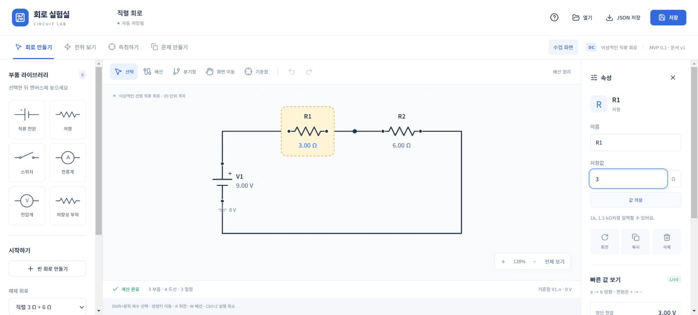
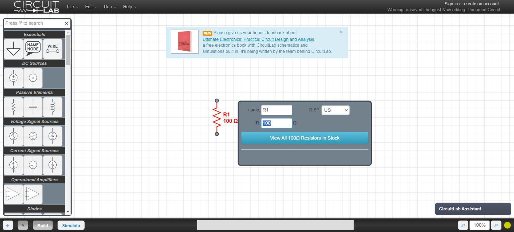
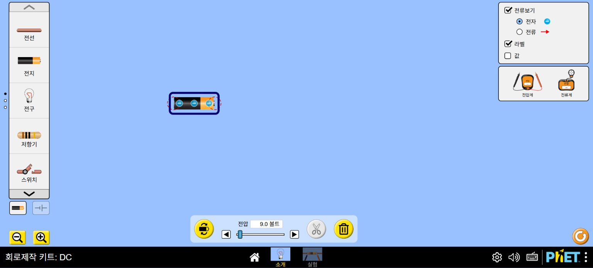
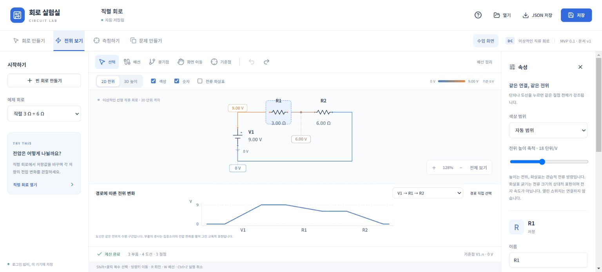
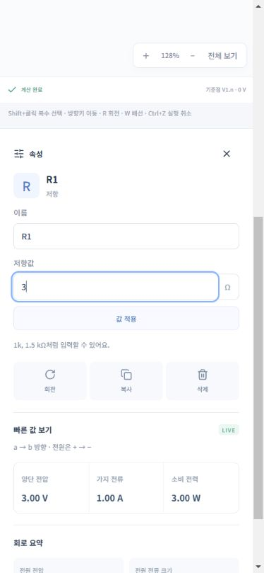
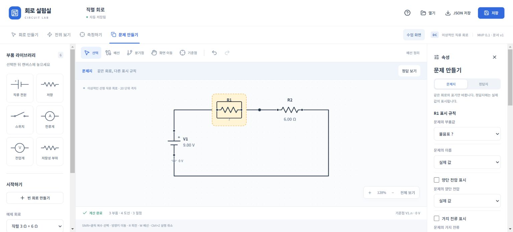
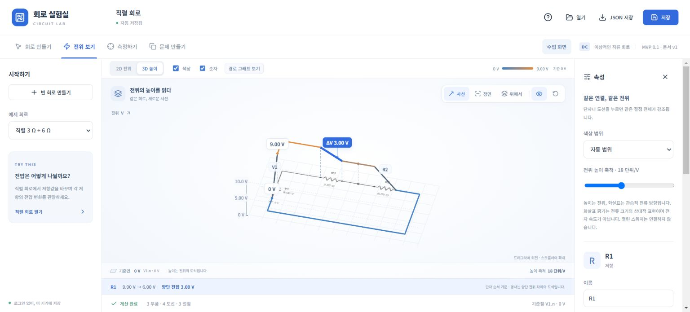

# MVP UI·UX 검토 — CircuitLab·PhET 비교

검토일: 2026-09-23 · 대상: `9e9a00e`, MVP 0.1.0, 단계 0–5 및 이후 UI 개선 · 상태: **검토 및 개선 제안, 구현 승인·요구사항 변경 아님**

후속: 같은 날 사용자가 이 문서에 따른 개선 구현을 요청했다. 아래 관찰·제안은 검토 당시 기록으로 보존하며, 적용 결과·지원 경계·실제 검증은 [MVP 작업 추적의 UX 제안 반영](../../implementation/mvp-tracker.md#후속--ux-제안-반영-2026-09-23)과 [ADR-013](../../../decisions/ADR-013-wire-editing-ux.md)에 기록했다.

## 1. 판단

**현재 MVP는 일관된 시각 스타일과 기능을 갖춘 작업대지만, 목표로 한 ‘설명서 없이 사용하는 세련된 교육 도구’에는 아직 미치지 못한다.** 가장 큰 차이는 장식보다 작업 흐름에 있다. 회로를 조작하는 위치와 입력하는 위치가 떨어져 있고, 목적이 바뀌어도 불필요한 패널이 남으며, 읽어야 하는 문구가 작고 흐리다. 교사의 최종 목표인 그림 복사보다 저장 버튼이 더 두드러진다.

우선 개선할 것은 **가독성, 회로 공간, 회로 위 직접 편집, 출력 동선, 저장 범위의 명확성**이다. 3D 효과나 부품 수를 추가하는 것보다 기존 기능을 더 적은 탐색과 화면 이동으로 사용할 수 있게 만드는 편이 제품 목표에 가깝다.

이 판단은 전문가 휴리스틱 검토다. 실제 학생·교사의 성공률이나 만족도, 경쟁 제품보다 빠르다는 결론을 입증한 사용성 연구는 아니다. 임의의 종합 점수나 기능 개수로 제품 순위를 매기지 않았다.

## 2. 기준과 검토 범위

기준은 [제품 원칙](../../../requirements/product-principles.yaml), [요구사항](../../../requirements/requirements.yaml), [제품 개요](../../product/brief.md), [UX 구조](../overview.md), [상호작용](../interactions.md), [사용 흐름](../workflows.md)이다. 편집·저장·측정의 의도는 [ADR-001](../../../decisions/ADR-001-svg-editor.md), [ADR-002](../../../decisions/ADR-002-state-management.md) 및 현재 구현을 대조했다.

- **직접 관찰:** Windows Chrome, 기본 콘텐츠 영역 1536×695 CSS px. 사용자의 기존 회로와 분리한 `127.0.0.1:5174`에서 검토했다.
- **작은 화면:** 390×844 CSS px의 Chrome 뷰포트. 실제 스마트폰·터치·가상 키보드 시험은 아니다.
- **조작:** 빈 회로/부품 배치, 값 클릭과 `1k` 입력·Enter·실행 취소, 전위 2D/3D, 두 탐침과 부호 반전, 문제값 `?` 표시와 PNG 미리보기, 단락 진단, 기록 후 새로고침.
- **비교:** CircuitLab 실제 편집기에서 진입·저항 드래그 배치·더블클릭 속성 편집, PhET CCK: DC 한국어판에서 소개 화면 진입·전지 드래그·선택 제어를 확인했다. 추가 동작은 공식 문서로 보완했다.
- **한계:** 완전한 회로 제작 시간, 경쟁 제품의 저장·내보내기 전체 흐름, 실제 워드프로세서 붙여넣기·프린터·프로젝터·200% 브라우저 확대·스크린리더 전체 흐름은 검증하지 않았다. 실행 중 응답이 즉각적이라는 인상은 성능 벤치마크가 아니다.

아래 **관찰**은 화면/DOM에서 재현한 사실, **코드**는 소스로 확인한 동작, **판단·제안**은 그 근거에서 도출한 개선안이다. 단계 6 공유·활동 배포를 현재 MVP 결함으로 계산하지 않았다. QLT-001은 단계 7 요구사항이므로 이번 접근성 발견을 곧바로 ‘단계 0–5 완료 선언 무효’로 해석하지 않는다.

## 3. 잘 된 부분

| 강점 | 확인 근거 | 유지할 이유 |
|---|---|---|
| 교과서형 기호와 차분한 외형 | 저항 지그재그, 흰 캔버스, 제한된 장식 색, 일정한 패널·버튼 스타일 | 고등학교 수업과 문제지의 시각 언어에 맞는다. |
| 단위 입력과 자동 계산 | R1에 `1k` 입력 후 Enter → `1.00 kΩ`, 전류 `8.95 mA`; 실행 취소로 복원 | 별도의 해석 설정 없이 실험할 수 있다. |
| 측정 모드의 목적 분리 | 편집 라이브러리가 사라지고 탐침·결과·기록으로 재구성 | 다른 모드 개선의 좋은 내부 참고 사례다. |
| 탐침 조작 피드백 | R1 양단을 차례로 클릭해 `3.00 V`, 순서 반전 후 `-3.00 V` | 자동 탐침 전환과 `+ / −` 표현이 조작과 물리 의미를 연결한다. |
| 출력의 독립성 | `?`로 바꾼 R1이 실제 PNG 미리보기에도 반영되고 선택 테두리는 제외 | 시험지 제작이라는 차별점의 기반이 있다. |
| 오류 설명의 내용 | 단락 예제에서 상태·물리 원인·수정 행동·관련 요소 버튼 확인 | 계산 실패를 단순 오류 메시지로 끝내지 않는다. |
| 3D의 읽기 보조 | 바닥 회로, 기준면, 전위 눈금, 카메라 프리셋, 선택 전압차 | 최근 개선이 유효하다. ‘3D가 전부 부족하다’는 평가가 적절하지 않다. |

## 4. 경쟁 도구에서 배울 점과 가져오지 않을 점

세 제품의 목적이 다르다. CircuitLab은 회로 설계·해석, PhET은 개념 탐구, 우리 제품은 고등학교 회로 학습과 교사 출력의 결합에 가깝다. 더 많은 소자나 해석 종류는 이 검토의 우수성 기준이 아니다.

| 비교 축 | CircuitLab | PhET CCK: DC | 현재 MVP에 대한 판단 |
|---|---|---|---|
| 작업 공간 | 얇은 상단 메뉴, 가장자리 도구, Build/Simulate 전환. 실제 진입 시 홍보 배너·Assistant도 있어 방해가 전혀 없지는 않음 | 큰 실험 공간 주변에 부품과 계기 배치 | 외형은 이미 정돈돼 있으나 고정 패널과 수평 제어줄이 회로 공간을 과하게 차지한다. |
| 값 변경 | 부품 더블클릭으로 가까운 속성 상자를 여는 것을 직접 확인 | 선택한 전지에 전압 슬라이더·방향·삭제 제어가 하단에 나타남 | 클릭 가능한 값이 있어도 먼 속성 패널로 이동한다. 회로 위 입력과 선택별 간결한 제어를 참고할 만하다. |
| 시작·발견 | 부품 검색과 범주가 풍부하지만 초보자에게 많은 선택을 제시 | 소개/실험의 진입 구분, 보이는 부품·계기, 값 표시 옵션 | 우리 앱의 예제 즉시 시작은 장점. 다만 ‘그리기/탐구/예제’라는 목표별 진입은 약하다. |
| 측정 표현 | 회로의 노드·단자에서 출력 대상을 선택하는 공식 흐름 | 계기를 공간 속 도구로 보여 주며 표시 정보를 선택하게 함 | 현재 두 점 클릭은 효율적이다. 선택 대상과 결과의 관계를 더 크게 보여 주면 된다. 실물 계기 외형을 그대로 복제할 필요는 없다. |
| 연결 편집 | Smart Wires 문서는 연결을 유지하는 이동과 L자 배선 동작을 설명 | 이번에는 전지 배치와 선택만 직접 검토 | 우리 앱의 명시적 연결 ID와 미리보기·실행 취소를 유지하면서, 배치될 기호·방향·연결 후보를 더 분명히 보여 주어야 한다. |
| 시각 언어 | 전문 도구의 밀도, 강한 격자와 오래된 형태의 제어가 남음 | 높은 식별성, 실물/회로도 표시 선택. 외형은 우리 고등학교용 목표와 다름 | 중성색·지그재그·절제된 표현은 유지하고, 두 도구의 조작 가시성과 정보 계층을 취한다. |
| 교사 출력 | 범용 회로도 작성·해석의 맥락 | 개념 탐구의 맥락 | 같은 문서의 문제·정답 전환과 그림 복사를 가장 명확한 완료 동작으로 만들어 차별화한다. 두 제품에 해당 기능이 절대 없다고 단정하지 않는다. |

CircuitLab의 기본 편집·접두어 입력·출력 선택은 [공식 The Basics](https://www.circuitlab.com/docs/the-basics/), 숙련 조작은 [Keyboard Shortcuts](https://www.circuitlab.com/docs/keyboard-shortcuts/), 연결 이동은 [Smart Wires](https://www.circuitlab.com/docs/smart-wires/)를 참고했다. Smart Wires는 해당 문서에 이용 범위 제한이 명시돼 있으며 이번 비로그인 세션에서 실행 검증하지 않았다. 예측 연결을 우리 앱에 그대로 도입하자는 제안도 아니다.

PhET의 비교 대상은 [Circuit Construction Kit: DC](https://phet.colorado.edu/en/simulations/circuit-construction-kit-dc)와 [실제 한국어 HTML5 실행 화면](https://phet.colorado.edu/sims/html/circuit-construction-kit-dc/latest/circuit-construction-kit-dc_all.html?locale=ko)이다. DC Virtual Lab과 일반 DC를 동일한 제품으로 취급하지 않았다.

경쟁 제품에도 약점이 있다. CircuitLab에서는 브라우저 확대 관련 경고가 실제로 나타났고, 공식 기본 문서도 브라우저 확대 제한을 안내한다. PhET 한국어 실행판의 접근성 트리에는 영어 설명이 섞였다. 어느 제품도 접근성·현지화·모바일 전체가 우수하다고 검증한 것은 아니다.

## 5. 정량 관찰

### 화면 공간

DOM의 `.circuit-canvas.getBoundingClientRect()` 면적을 콘텐츠 뷰포트 면적으로 나눴다. 회로가 실제로 그려진 잉크 면적이나 작업 성공률이 아니라 **조작 가능한 2D 캔버스 영역**의 비율이다. 경쟁 제품과 동일 조건의 면적 측정은 하지 않았다.

| 모드, 직렬 예제 | 캔버스 크기 | 1536×695 대비 면적 |
|---|---:|---:|
| 회로 만들기 | 1052×432.2 px | 42.6% |
| 전위 보기 2D, 그래프 열림 | 1052×239.6 px | 23.6% |
| 측정하기 | 1246×312.8 px | 36.5% |

전위 2D에서는 좌우 패널, 편집 툴바, 전위 제어, 그래프가 동시에 보인다. 회로 읽기가 목적이지만 기본 편집 화면보다 회로가 작아진다. 3D는 그래프를 기본 접고 편집 툴바를 숨기는 개선이 이미 있어 구분해서 평가해야 한다.

### 텍스트 대비

렌더링된 DOM의 계산된 글자색과 불투명 조상 배경색을 사용해 sRGB 상대 휘도로 계산했다. 아래는 비활성화된 버튼이나 로고가 아닌, 실제 읽어야 하는 텍스트다. 반투명 합성·전체 상태를 포괄하는 접근성 인증은 아니다.

| 대상 | 글자 크기 | 전경 / 배경 | 대비 |
|---|---:|---|---:|
| 비선택 모드 탭 | 12 px | `#8b96a6` / `#ffffff` | 3.00:1 |
| 부품 배치 안내 | 11 px | `#8a95a5` / `#ffffff` | 3.03:1 |
| 하단 단축키 안내 | 9 px | `#9aa6b5` / `#f5f7fa` | 2.30:1 |
| 자동 저장됨 | 10 px | `#99a3b1` / `#ffffff` | 2.55:1 |

일반 텍스트에 요구되는 AA 기준 4.5:1보다 낮다. ‘비선택 탭’은 사용 가능한 제어이므로 disabled 예외와 다르다. 수치는 표시용 반올림이다. 기준과 계산식: [W3C — Contrast (Minimum)](https://www.w3.org/WAI/WCAG22/Understanding/contrast-minimum.html).

측정 원자료와 재현 조건은 [measurements.json](assets/2026-09-23/measurements.json)에 보관했다.

## 6. 개선 항목

P1은 핵심 작업의 명확성·완료·신뢰에 직접 영향을 주어 다음 UX 개선에서 먼저 다룰 항목, P2는 반복 작업과 학습 경험을 개선할 항목, P3는 마감 정리다. 이번 검토에서 서비스 중단급 P0를 선언할 근거는 얻지 못했다. ‘영향’은 관찰에 근거한 예상이며 사용자 연구의 실측 결과가 아니다.

| ID | 우선순위 | 문제 | 근거 | 관련 계약 |
|---|---|---|---|---|
| UX-01 | P1 | 작은 글자와 낮은 대비 | 화면·대비 실측 | P-01/04, QLT-001 |
| UX-02 | P1 | 목적에 비해 과한 고정 패널과 좁은 회로 공간 | 모드 전환·면적 실측 | P-04, VIS-001~005 |
| UX-03 | P1 | 회로 위 값 클릭이 원거리 패널 편집으로 이어짐 | 데스크톱·390px 재현 | P-02, EDT-004 |
| UX-04 | P1 | 문제 제작의 최종 출력 행동이 스크롤 아래에 묻힘 | R1 선택 상태의 버튼 좌표 | TCH-001~003 |
| UX-05 | P1 | 자동 저장 표시와 측정 기록 보존 범위가 다름 | 기록 1개 → 새로고침 → 0개 | DAT-001/002, MEA-003 |
| UX-06 | P2 | 배치 미리보기가 실제 부품의 방향·극성을 보여 주지 않음 | 빈 회로에 전원 배치, 코드 | EDT-001/002, P-02 |
| UX-07 | P2 | 첫 방문의 목적 선택과 다음 행동 안내가 약함 | 신규 origin의 초기 화면·빈 화면 | P-02/04, UX 구조 문서 |
| UX-08 | P2 | 측정과 값 변화의 왕복 비용, 내부 ID 중심 표현 | 측정 UI·ADR-002·코드 | MEA-001~004, SIM-005/006 |
| UX-09 | P2 | 3D의 시각 개선에 비해 학습 동선·축척 언어가 부족 | 2D/3D 화면·분기 렌더링 | VIS-004/005, P-05 |
| UX-10 | P2 | 진단은 설명하지만 조립 중 안내·수정 행동의 구분이 약함 | 전원 하나 배치·단락 예제 | SIM-004, P-06 |
| UX-11 | P2 | 선택 상태의 접근성 표현과 기기별 검증이 미완 | DOM·CSS·부분 실기 | QLT-001, 완료 정의 |
| UX-12 | P3 | 개발용·전문용 문구와 상황에 맞지 않는 도움말 | 여러 모드에서 반복 관찰 | P-01/04 |

### UX-01 — ‘차분함’과 ‘흐림’을 분리해야 한다

**관찰:** 필요한 탭·상태·안내의 글자가 9~12 px이며 여러 색 조합이 4.5:1에 못 미친다. 주요 값은 잘 보이지만 주변 조작 설명이 상대적으로 읽기 어렵다.

**제안:** 제목·본문·보조문구·비활성 제어를 구분한 타입/색상 기준을 만들고, 조작 이름과 상태는 대비를 확보한다. 일반 본문·제어 13~14 px, 보조문구 12 px 이상을 우선 시안으로 검증한다. 크기 수치는 새 제안이며 기존 규범이 아니다. 물리량 색상 팔레트와 UI 강조색은 따로 관리한다.

**수용안:** 활성/비선택/hover/오류/저장 상태의 일반 텍스트가 4.5:1 이상. 비활성 제어 예외는 따로 기록. 프로젝터 실기에서 뒤쪽 자리의 판독을 추가 확인한다.

### UX-02 — 모드는 이름뿐 아니라 공간도 바꿔야 한다

**관찰:** 전위 2D에서도 배선·분기점·배선 정리, 예제용 왼쪽 패널, 선택 부품의 회전·복사·삭제가 남는다. 2D인데 높이 축척 슬라이더도 보인다. 문제 모드에는 부품 라이브러리와 빠른 계산값이 남는다.

**제안:** 전위 보기에서는 회로·범례·선택값을 우선하고 예제와 속성은 접을 수 있게 한다. 경로 그래프는 명시적으로 열거나 크기를 조절한다. 문제 모드는 표시 규칙·주석·출력에 집중한다. 측정 모드가 이미 보여 주는 목적별 재구성을 확장한다.

**수용안:** 같은 1536×695에서 전위 2D의 주 회로 높이를 최소 360 px 확보하는 안을 검증한다. 상세 패널을 열어도 사용자가 공간을 되찾을 수 있어야 한다. 이 크기 목표는 제안이며, 수업 화면 버튼만으로 일반 작업 공간의 문제를 해결했다고 보지 않는다.

### UX-03 — 직접 편집의 시작과 끝을 같은 장소에 둔다

**관찰:** 회로 값 클릭은 작동하지만 실제 입력은 오른쪽 패널이다. `1k`와 Enter도 정상 작동한다. 390×844에서는 값 클릭 후 약 574 px 스크롤이 발생해 캔버스가 y=-296~112, 입력란이 y=404~441에 놓였다. 회로와 변경 결과를 함께 읽기 어렵다.

**코드:** `App.tsx`의 `onValue`가 선택 후 `valueInput.current.focus()`를 호출한다. 현재는 인라인 입력이 없다.

**제안:** 값 옆의 작은 입력창에서 Enter 적용·Esc 취소를 제공하고, 속성 패널은 상세 편집의 보조 경로로 둔다. 모바일에는 회로를 가리지 않는 제한된 높이의 편집 패널을 검토한다. 회전·복사·삭제도 선택 위치 근처에서 접근하게 한다.

**수용안:** 값 클릭→입력→Enter→결과 확인 동안 화면 이동 없이 대상과 결과가 보인다. 잘못된 입력은 입력란 근처에 이유를 표시하고 이전 값을 보존한다. EDT-004의 값 파싱 충족과 ‘회로 위에서 직접 수정’이라는 UX 목표 충족은 구분해서 재검토한다.

### UX-04 — 출력이 문제 제작의 명확한 도착점이어야 한다

**관찰:** R1을 선택하면 표시 규칙 네 묶음과 옵션 아래에 `그림 복사 · PNG`가 놓인다. 패널 상단 기준 버튼 y=877~912로 695 px 화면 밖이다. 반면 최상단의 파란 `저장`은 계속 보인다. 문제/정답 전환도 중앙과 속성 패널에 중복된다. 실제 PNG 결과는 정상 확인했다.

**제안:** 문제 모드의 고정 작업줄에 `문제 / 정답`, `미리보기`, `그림 복사`를 둔다. 파일 형식·배율·여백은 보조 메뉴로 둔다. 여러 필드를 각각 설정하는 것 외에 ‘선택한 값 숨기기’ 같은 명확한 일괄 동작을 검토한다. 주석 위치는 회로 클릭을 기본으로, 단자 ID 목록은 보조로 둔다.

**수용안:** 부품을 선택한 상태에서도 세로 스크롤 없이 복사·미리보기·문제/정답 전환 가능. 출력은 기존처럼 문서와 공통 기호에서 생성한다. 교사의 2분 목표는 실제 붙여넣기를 포함해 별도로 측정한다.

### UX-05 — 회로 저장과 실험 기록 저장의 차이를 화면에서 알려야 한다

**관찰:** 합성 측정 기록 1개를 만든 뒤 새로고침하면 회로는 복원되지만 기록은 0개가 된다. 일반 화면에는 `자동 저장됨`이 표시된다. 빠른 시작 문서는 메모리 저장 제한을 설명하지만 측정 패널에서 같은 설명은 찾지 못했다.

**판단:** 구현이 문서와 다르다는 결함이 아니라, 사용자가 화면에서 추정하는 보존 범위와 실제 동작 사이의 위험이다. `저장`, `JSON 저장`, `자동 저장`, `마지막 저장본 복원`의 관계도 즉시 이해하기 어렵다.

**제안:** `회로 자동 저장됨 · 이 브라우저`처럼 범위를 표시하고 기록 영역에는 `기록은 CSV로 보관`을 명시한다. 명시 저장은 ‘복원 지점 저장’처럼 결과를 드러내는 이름을 검토한다. 기록 영속화를 선택한다면 회로 구조와 분리된 저장 정책을 설계한다.

**수용안:** 사용자가 종료 전에 무엇이 남는지 UI만으로 알 수 있다. 새로고침·다른 회로 열기·JSON 재열기별 보존 표를 문서화한다. 기록을 `CircuitDocument`에 임의로 넣거나 기존 형식을 조용히 확장하지 않는다.

### UX-06 — 부품을 놓기 전에 결과를 예측할 수 있어야 한다

**관찰·코드:** 전원을 고르면 실제 전원 기호 대신 `여기에 배치` 사각형과 수평 단자 두 개가 미리 보인다. 이 미리보기는 부품 종류에 공통이다. 최종 전원은 세로 방향이므로 방향·극성을 미리 읽을 수 없다.

**제안:** 실제 공통 기호, 회전 상태, 단자, 극성을 반투명하게 보여 준다. 연결 시작점·끝점 후보·확정 경로의 시각적 구분을 점검한다. 최근 개선한 이동 미리보기와 확정의 일치는 유지한다.

**수용안:** 전원·저항·스위치의 미리보기와 배치 후 기호/단자 위치가 일치한다. 배선 변경은 명시적 사용자 행동으로만 확정하고 실행 취소할 수 있다. 이번 검토는 이동 경로가 다시 깨진다는 주장이 아니다.

### UX-07 — 예제 즉시 시작의 장점을 유지하며 목적을 드러낸다

**관찰:** 신규 origin에서도 직렬 예제가 즉시 열린다. 시작 선택지는 왼쪽 라이브러리 아래에 있고, 제안 카드의 내용은 다른 예제·빈 회로에서도 직렬 전압 나눔으로 고정된다. 빈 화면의 배치 안내는 있다.

**제안:** 강제 온보딩 대신 ‘바로 그리기 / 회로 탐구 / 예제’ 진입을 가볍게 제공한다. 첫 부품 뒤에는 ‘단자를 눌러 연결’처럼 현재 상태에 맞는 한 행동만 제시한다. 정상 예제와 오류 진단 예제를 묶어서 구분한다.

**수용안:** 첫 부품 10초·직렬 완성 1분이라는 기존 목표를 초보 사용자에게 측정한다. 예제 선택과 빈 캔버스 어느 쪽이 더 잘 맞는지 먼저 검증하고 홈 화면 추가를 정답으로 전제하지 않는다.

### UX-08 — 측정의 간결함을 값 변화 실험까지 연결한다

**관찰:** 측정 모드는 탐침과 결과가 잘 분리돼 있고 두 점 클릭도 효율적이다. 다만 실제 값을 바꾸거나 스위치를 전환하려면 편집으로 나갔다 돌아와야 한다. 탐침 목록의 `R1 · a`, 등가저항의 `포트 전원 분리 / 전원 0 V 치환`, KCL/KVL 등은 학습자의 선행 지식을 요구한다.

**판단:** 측정 모드의 편집 차단은 ADR-002에 명시된 의도적 설계다. 이를 버그로 보고 해제하면 안 된다.

**제안:** 기존 값 변화 실험의 진입을 더 발견하기 쉽게 만들고, 탐침 선택과 대상 부품을 화면에서 연결해 표시한다. 용어는 물리 의미를 보존하되 `이 전원에서 본 부하 저항` 같은 목적 설명을 함께 제공한다. 측정 중 제한된 값 변경을 도입하려면 권한·기록 조건·ADR을 먼저 정리한다.

**수용안:** 학생이 빨강−검정의 부호, 선택한 가지, 어떤 전원을 분리한 등가저항인지 화면으로 설명할 수 있다. 내부 ID는 보조 정보로 유지한다. 실제 계기 연결 훈련과 빠른 두 점 측정을 같은 행동이라고 설명하지 않는다.

### UX-09 — 3D를 감상 화면에서 설명 도구로 완성한다

**관찰:** 현재 3D는 기준면·전위 눈금·선택 전압차가 있으며 2D 회로의 바닥 투영도 제공한다. 반면 왼쪽 예제 패널과 오른쪽 상세 설정이 남고 `18 단위/V`는 화면 기하 단위다. 2D에서 3D로의 전환은 코드상 서로 다른 뷰를 교체하며, UX 문서가 설명한 동일 회로의 연속적인 기울임·높이 변화 전환과는 다르다.

**제안:** 선택한 저항의 양끝 전위와 차이를 중심으로 읽기 순서를 만든다. 높이 조절은 기준을 정의한 ‘높이 강조 배율’로 표현한다. 도선 등전위→전원 상승→저항 하강→한 바퀴 합의 설명 동선을 검토한다. 연속 전환은 학습 효과가 확인될 때 적용하고 움직임 감소를 보장한다.

**수용안:** 3D에서 선택한 부품을 2D·경로 그래프에서 추적할 수 있고, 학생이 높이를 실제 공간 높이·도선 저항으로 오해하지 않는다. 모션 자체를 핵심 수용 기준으로 앞세우지 않는다.

### UX-10 — 진단을 ‘조립 중’과 ‘고칠 문제’로 나눈다

**관찰:** 전원 하나를 놓으면 동일한 미연결 단자 안내 카드가 두 번 나타난다. 단락 설명은 유용하지만 진단이 속성·요약 아래에 있고 `관련 요소 보기`는 선택 상태를 바꾸는 동작이다. 빈 회로에도 이 버튼이 있다.

**제안:** 조립 중에는 ‘전원 단자 2곳을 연결하세요’처럼 묶은 진행 안내를, 불가능한 해석에는 원인·영향·수정 행동을 제공한다. 관련 단자/도선을 보이게 이동·강조하고, 가능한 경우 ‘문제 도선 선택’ 같은 구체적 행동을 붙인다. 계산의 안정적인 진단 코드와 대상 ID는 그대로 둔다.

**수용안:** 같은 원인의 카드가 불필요하게 반복되지 않고, 문제 요소와 안내를 함께 볼 수 있다. 올바른 열린 회로까지 위험 상태로 과장하지 않는다.

### UX-11 — 보이는 선택과 보조기술의 선택 상태를 맞춘다

**코드·DOM:** 주요 모드 버튼은 CSS `active`로 표시되지만 `aria-pressed`나 탭 선택 상태가 없다. 측정 도구와 3D 카메라는 pressed 상태가 있어 구현 간 차이가 있다. 단자에는 약 40 px의 투명 타깃, 키보드 처리, 포커스 스타일이 이미 있으므로 ‘터치/키보드 지원이 없다’고 평가할 수는 없다.

**작은 화면 관찰:** 편집 라이브러리는 가로 스크롤, 속성은 캔버스 아래로 이동한다. 측정은 도구·탐침·결과·회로·기록 순서를 유지한다. 모바일의 우선 문제는 지원 유무보다 UX-03의 편집 시 문맥 단절이다.

**제안·수용안:** 모드 상태를 의미적으로 전달하고 키보드로 선택 상태를 확인한다. 200% 확대, 실제 태블릿 터치, 가상 키보드 표시, 포커스 이동·모달 복귀를 별도 검증한다. 코드상 미디어쿼리 존재를 기기 검증 통과로 대체하지 않는다.

### UX-12 — 개발 정보는 학습·제작 목적의 문구로 바꾼다

**관찰:** `MVP 0.1 · 문서 v1`, `20 단위 격자`, `18 단위/V`, `명시 저장`처럼 구현 배경이 필요한 표현이 있다. 전압 입력에도 `1.5 kΩ` 예시가 나오고, TRY THIS·LIVE·CIRCUIT LAB 등 영어 표기가 섞인다.

**제안:** 버전은 정보 메뉴로, 입력 예시는 부품의 단위에 맞게, 저장 알림은 사용자가 얻는 결과로 표현한다. 약어는 처음에 한국어 의미를 함께 제시한다. 영문 자체를 금지하기보다 의미 전달에 도움이 되는지 판단한다.

## 7. 권장 개선 순서

1. **읽기와 완료 동작:** UX-01, UX-04, UX-05. 대비·폰트 기준, 고정 출력 동작, 저장 범위를 먼저 정리한다.
2. **회로 중심 작업 공간:** UX-02, UX-03, UX-06. 모드별 패널 구조와 인라인 편집, 실제 기호 미리보기를 함께 검증한다. 모바일 문맥 단절도 이 단계에서 다룬다.
3. **학습·반복 조작:** UX-07~10. 처음 연결, 값 변화, 측정, 3D 설명, 진단 복구의 짧은 흐름을 다듬는다. 의도된 계약 변경은 별도 결정으로 처리한다.
4. **사용자·접근성 검증:** UX-11/12를 포함해 교사·학생 과제를 반복한다. 이후 단계 6~7 확대 여부를 판단한다.

위 순서는 제안이며 공유·계정·새 물리 소자·AI 기능을 앞당기는 계획이 아니다. 문서만 변경한 이번 검토에서 구현 완료나 새 단계 시작을 선언하지 않는다.

후속 논의의 **도선 위 부품 삽입·교차점 연결 선택·비연결 교차 표시**는 [11절](#11-후속-편집-ux-요구와-설계-방향)에 정리했다. 최초 검토의 12개 발견과 구분되는 사용자 요청이며, 다음 편집 UX 설계에 포함한다.

## 8. 개선 효과를 확인할 사용자 과제

교사 5명·학생 5명 내외의 소규모 형성 평가를 우선 제안한다. 이는 모집·실행한 결과가 아니며 통계적 대표성을 주장할 표본 규모도 아니다. 비교 전후 같은 회로 난도와 기기를 사용하고, 시간을 재는 동안 설명을 요구하지 않은 뒤 회고 질문을 한다.

| 과제 | 기록할 것 | 목표/판정 |
|---|---|---|
| 처음 들어와 전원 배치 | 시작부터 확정 배치까지 시간, 도움 요청 | 기존 제품 목표 10초 |
| 전원+저항 2개 직렬 완성 | 잘못 연결한 횟수, 취소, 성공 시간 | 기존 제품 목표 1분 |
| R1을 1 kΩ으로 바꾸기 | 입력 위치 탐색, 화면 이동, 결과 확인 | 회로와 입력이 함께 보이는지 |
| R1 전압 측정 후 부호 반전 | 탐침 위치, 부호 설명, 오조작 | 크기 유지·부호 반전 이해 |
| 같은 도선의 전위 설명 | 2D 색·숫자·3D 높이의 대응 설명 | 도선 전압 강하 등 오개념 여부 |
| R1을 ?로 바꾸고 흑백 그림 붙여넣기 | 출력 찾기·미리보기·실제 문서 붙여넣기 시간 | 기존 제품 목표 2분 |
| 기록 후 종료 준비 | 무엇이 저장되는지 답변, CSV 보관 | 회로·기록 보존 범위 구분 |
| 단락 예제 고치기 | 진단 이해, 대상 발견, 수정·되돌리기 | 설명서 없이 원인과 행동 연결 |

목표 미달은 ‘사용자가 익숙하지 않다’로 설명하지 말고, 발견·조작·확인 중 어느 단계에서 막혔는지 분리한다. 자동 코드 테스트와 브라우저 검토만으로 이 목표를 달성했다고 기록하지 않는다.

## 9. 구현 추적용 근거

| 근거 파일 | 확인한 부분 |
|---|---|
| [App.tsx](../../../src/app/App.tsx) | `onValue`, `valueInput`, 모드별 패널, 자동 저장 표시, 진단 카드, 저장/복원 동작 |
| [CircuitCanvas.tsx](../../../src/app/CircuitCanvas.tsx) | `placement` 미리보기, 값 클릭, 단자 타깃, 키보드 처리 |
| [styles.css](../../../src/app/styles.css) | 고정 패널 폭·작은 텍스트·대비, 640/850 px 반응형, 전위 그래프 높이 |
| [WorksheetPanel.tsx](../../../src/app/WorksheetPanel.tsx) | 표시 규칙→주석→인쇄 옵션→출력 순서, 실제 PNG 미리보기 |
| [MeasurementPanel.tsx](../../../src/app/MeasurementPanel.tsx) | 메모리 `records`, CSV, 탐침·등가저항 용어, 값 변화 실험 |
| [measurement.css](../../../src/app/measurement.css) | 측정 전용 배치와 모바일 순서 |
| [3D UI](../../../src/potential-3d/index.tsx) · [3D 스타일](../../../src/potential-3d/styles.css) | 카메라·선택값·축척·가독성 |
| [빠른 시작](../quick-start.md) | 기록이 메모리에만 남는 제한, 저장·출력·조작 설명 |

## 10. 화면 증거

스크린샷은 검토일의 실제 화면이다. 비교 제품 화면의 권리는 해당 제공자에게 있으며 디자인 복제용 자산이 아니다.

| 파일 | 상태 |
|---|---|
| [01](assets/2026-09-23/01-edit-selected.png) | 데스크톱 값 클릭 후 속성 입력 |
| [02](assets/2026-09-23/02-potential-2d.png) | 전위 2D·그래프·속성 동시 표시 |
| [03](assets/2026-09-23/03-potential-3d.png) | 3D·R1 전압차 선택 |
| [04](assets/2026-09-23/04-measurement.png) | R1 양단 3 V 측정 |
| [05](assets/2026-09-23/05-worksheet-selected.png) | 문제 표시 규칙 설정 |
| [06](assets/2026-09-23/06-export-preview.png) | 선택 테두리를 제외한 실제 PNG |
| [07](assets/2026-09-23/07-diagnostic.png) | 단락 예제·관련 요소 선택 |
| [08](assets/2026-09-23/08-placement.png) | 전원 배치 전 공통 사각형 미리보기 |
| [09](assets/2026-09-23/09-mobile-build.png) | 390×844 편집 기본 화면 |
| [10](assets/2026-09-23/10-circuitlab-entry.png) | CircuitLab 초기 진입·Assistant 열림 |
| [11](assets/2026-09-23/11-phet-selected.png) | PhET 전지 선택·전압 제어 |
| [12](assets/2026-09-23/12-circuitlab-properties.png) | CircuitLab 부품 근처 속성 상자 |
| [13](assets/2026-09-23/13-mobile-value-edit.png) | 모바일 값 입력으로 자동 스크롤 |
| [14](assets/2026-09-23/14-mobile-measure.png) | 모바일 측정 도구·회로·기록 배치 |

## 11. 후속 편집 UX 요구와 설계 방향

추가일: 2026-09-23. 아래 두 기능과 비연결 교차의 시각 표시는 사용자가 문서 반영을 명시적으로 요청했다. 세부 조작·지원 범위는 설계 제안이며, 현재 구현됐거나 스키마·공개 계약이 확정됐다는 뜻은 아니다. 관련 요구사항은 EDT-001/002/003/005/006, SIM-001, TCH-003, 원칙은 P-02/04/05다.

### 11.1 기기별 목표와 터치 배선

앞선 논의에서는 **데스크톱과 스마트폰의 편집 기능을 동일한 사용성으로 제공하는 목표를 완화**하는 방향을 제안했다. 사용자가 지원 축소를 확정한 것은 아니므로 기존 지원 범위 변경은 별도 결정한다.

| 환경 | 우선 경험 제안 |
|---|---|
| 데스크톱·노트북 | 정밀 배선, 복잡한 회로 제작, 문제지 편집·출력 |
| 태블릿 | 기본 회로 제작·배선, 수업 중 조작 |
| 스마트폰 | 예제 탐구, 값·스위치 변경, 측정·전위 보기; 복잡한 제작의 편의성은 후순위 |

터치에서는 단자를 누른 채 도선 전체를 그리게 하기보다 **시작 단자 탭 → 후보와 직각 경로 미리보기 → 끝 단자 또는 도선 탭으로 확정**하는 조작을 기본으로 제안한다. 드래그는 데스크톱의 빠른 보조 경로로 둔다. 시작점·진행 상태·취소를 표시하고, 가까운 후보가 여럿이면 선택 대상을 확대하거나 후보를 구분한다. 타깃을 무조건 키워 서로 겹치게 하는 것으로 해결하지 않는다.

### 11.2 도선 위에 부품을 놓으면 자동으로 연결한다

**사용자 요구:** 도선 위에 부품을 올리면 필요한 연결점을 자동으로 만들고 회로에 연결해야 한다. 사용자가 도선을 먼저 지우고 양쪽을 다시 그리는 수작업을 줄인다.

**기본 의미는 해당 도선 구간에 부품을 직렬로 삽입하는 것**으로 정리한다. 예를 들어 `A ───── B`에 저항 R을 놓으면 `A ── R ── B`가 된다. 기존 도선을 저항 아래에 그대로 남겨 R을 우회·단락시키면 안 된다.

제안 흐름:

1. 새 부품을 도선에 가까이 가져가면 대상 구간을 강조하고 `도선에 삽입` 상태를 보여 준다.
2. 실제 부품 기호·단자·방향과 함께 끊길 구간, 양쪽에 연결될 도선을 미리 보여 준다. 자동 회전이나 위치 맞춤도 이 단계에서 드러나야 한다.
3. 놓기 또는 터치 배치 탭을 확정 행동으로 사용한다. 명확한 후보가 있으면 매번 확인 대화상자를 띄우지 않는다.
4. 기존 구간을 분할·대체하고 양쪽 도선을 부품의 서로 다른 단자에 연결한다. 필요한 연결점은 앱이 생성한다.
5. 부품 추가·위치/방향·도선 분할·연결점 생성 전체를 **한 번의 실행 취소**로 되돌린다. 터치에서도 삽입 취소 또는 실행 취소에 바로 접근할 수 있어야 한다.

여기서 ‘노드를 자동 생성한다’는 말은 사용자 관점의 연결 자동화다. 내부에서는 `Terminal`과 `Wire`의 명시적 참조를 만들고, 여러 도선이 실제로 모이는 경우에 `Junction`을 사용한다. 모든 부품 단자에 불필요한 분기점 점을 추가하거나, 계산 결과인 `Net`을 저장 문서에 직접 넣는다는 뜻은 아니다. 부품 양단의 두 연결점이 회로 전체에서 항상 서로 다른 net이라는 보장도 없다. 다른 우회 경로의 존재는 연결망 해석으로 판정한다.

설계 시 다룰 경계 조건:

- 교차점·꺾임·기존 분기점 근처처럼 대상이 모호하면 어느 도선에 삽입할지 먼저 선택하게 한다. 겹친 두 도선에 동시에 연결하지 않는다.
- 부품이 들어갈 공간이 부족하면 주변 배선 조정안을 미리 보여 주거나 삽입 불가 이유를 표시한다. 놓은 후에 예고 없이 다른 회로를 정리하지 않는다.
- 최초 우선 흐름은 라이브러리에서 새 부품을 놓는 경우다. 이미 연결된 부품을 다른 도선으로 옮길 때 원래 연결을 어떻게 처리할지는 별도 정책으로 확정한다. 기존 이동·배선 유지 규칙을 조용히 바꾸지 않는다.
- 전원·전류계 등 방향이나 연결 방식의 의미가 있는 부품은 극성·방향을 보여 준다. 전압계를 도선 위에 놓았다는 이유로 병렬 측정 연결을 추측해 만들지 않는다. 계기의 자동 삽입 허용 범위와 측정 UX는 함께 검토한다.

### 11.3 교차점마다 연결과 비연결을 선택한다

**사용자 요구:** 도선이 교차할 때 해당 지점을 노드로 연결할지, 전기적으로 연결하지 않고 넘어갈지 선택할 수 있어야 한다. 생성 시뿐 아니라 기존 교차점을 선택해서도 바꿀 수 있어야 한다.

| 상태 | 화면 표현 | 전기적 의미 |
|---|---|---|
| 연결 | 교차 중심에 명확한 채운 분기점 점 | 교차 도선들이 같은 명시적 연결점을 참조 |
| 비연결 | 한 도선이 다른 도선을 작은 아치로 넘어가는 브리지 표시; 중심에 분기점 점 없음 | 해당 교차 위치에서는 두 도선 사이 연결이 없음 |

새 교차는 기존 규칙에 맞게 **기본 비연결**로 두고, 배선 미리보기 또는 교차점 선택 도구에서 `연결` / `연결하지 않음`을 명시적으로 제공하는 안을 제안한다. 사용자 선택은 교차점별로 적용한다. 매 교차마다 모달을 띄우거나 우클릭·길게 누르기만을 유일한 경로로 사용하지 않는다.

- **비연결 → 연결:** 관련 도선을 교차점에서 나누고 공통 Junction을 참조하게 한다. 점만 그려 연결된 것처럼 보이게 해서는 안 된다.
- **연결 → 비연결:** 어느 도선이 어느 도선으로 계속 이어지는지 보존하면서 두 통과 경로를 분리한다. 점만 숨기고 전기 연결을 남겨서는 안 된다.
- 네 갈래 직교 교차에서는 가로·세로 통과 경로를 보여 줄 수 있다. T자 분기, 겹친 도선, 여러 가지가 모인 지점은 분리 후 연결 쌍이 모호할 수 있으므로 미리보기에서 대상을 지정하게 한다. 임의의 두 갈래를 묶지 않는다.
- 전환은 원자적인 명령 한 번으로 처리하며, 연결된 부품·기준점·주석의 참조를 보존하거나 필요한 재지정을 명확히 처리한다. 유효한 새 문서를 만들 수 없으면 원본을 유지한다.
- 같은 두 도선이 다른 위치에서 이미 연결됐을 수도 있다. 브리지 표시는 **이 교차 위치에서 접속하지 않음**을 뜻하며, 두 도선의 전위가 반드시 다르다는 뜻은 아니다.

### 11.4 비연결 교차의 시각 규칙

단순히 분기점 점이 없다는 것만으로 구별시키지 않고, 사용자가 요청한 **넘어가는 도선 모양**을 기본 식별 수단으로 한다.

- 브리지는 작은 반원 또는 이에 준하는 아치로 그린다. 그 아래 교차하는 도선은 연속으로 보여야 하며, 확대·축소 후에도 연결점 점과 혼동되지 않아야 한다.
- 어느 도선이 넘어가는지에 대한 기본 규칙은 일관되고 결정론적이어야 한다. 예를 들어 가로 도선이 넘어가게 하는 규칙을 검토하되 최종 선택은 출력 가독성과 함께 정한다.
- 검정 선만으로도 `연결점`과 `넘어감`을 구별한다. 색상·hover·선택 표시가 없어도 읽을 수 있어야 한다.
- 브리지의 작은 우회 곡선은 **전기적 도선 길이·저항·전압 강하 또는 3D 전위 높이**를 뜻하지 않는다. 전위 색은 해당 도선 전체에서 일관돼야 한다.
- 편집 화면·문제지·정답지·SVG·PNG가 같은 연결 상태와 교차 표시 규칙을 사용한다. 투명 배경에서도 아래 도선이나 브리지 틈이 잘못 가려지지 않는지 확인한다. 현재 화면 캡처로 출력을 대체하지 않는다.

### 11.5 구현 전 결정과 수용 기준

이 내용은 후속 설계 요구다. 구현 시 EDT-001/002/003/006의 수용 기준을 구체화하고 관련 ADR·단위/통합 테스트를 같은 변경 단위에서 갱신한다. 연결은 좌표 중첩이 아니라 문서 ID 참조로 확정한다. 미리보기는 일시 UI 상태로 두며 명령 권한·유효성 검사를 우회하지 않는다.

브리지의 방향을 문서에서 결정론적으로 재생성할 수 있는지, 사용자 지정 방향이나 분리 경로를 저장해야 하는지는 설계 단계에서 결정한다. 저장 형식을 바꾸는 경우에만 버전·순차 마이그레이션·이전 fixture 호환 계획을 함께 수립한다. 이번 문서화에서는 새 스키마 필드를 확정하지 않는다.

| 검증 과제 | 제안 수용 기준 |
|---|---|
| 단일 도선에 저항 삽입 | 원래 구간이 부품 양쪽 도선으로 바뀌고 저항 아래 우회 도선이 남지 않는다. 미리보기와 확정이 같다. |
| 삽입 후 계산 | 예: 9 V·3 Ω 직렬 회로의 도선에 6 Ω 삽입 시 전류가 3 A에서 1 A로 변한다. 계산값뿐 아니라 연결 참조도 검사한다. |
| 삽입 취소·실행 취소·다시 실행 | 도선 경로·ID 참조·부품·분기점을 하나의 변경으로 복원한다. 모호한 후보에서 취소해도 원본은 바뀌지 않는다. |
| 교차 연결/비연결 전환 | 이 교차 외에 연결 경로가 없는 fixture에서 분리 net↔공통 net이 예상대로 바뀌며, 점/브리지 표시도 일치한다. |
| 다른 위치의 우회 연결 | 한 교차를 비연결로 바꿔도 다른 연결 경로가 있으면 같은 net일 수 있음을 올바르게 처리한다. |
| 여러 교차점 | 한 교차점만 바꿔도 다른 교차점의 연결과 도선 경로는 유지된다. |
| 표시와 출력 | 축소·흑백·투명 배경의 편집 화면 및 SVG/PNG에서 연결점과 비연결 브리지를 구분할 수 있다. |
| 저장·재열기 | 연결 상태와 교차 표현이 재현되고 기준점·주석 참조가 손상되지 않는다. |
| 터치·키보드 | 드래그·우클릭 없이도 삽입과 교차 선택·확정·취소를 완료한다. |

사용성 검증에는 기존 직렬 제작 과제에 **도선에 저항 삽입 → 병렬 가지 추가 → 교차 한 곳 연결 → 다시 비연결로 변경 → 흑백 출력 확인**을 추가한다. 이 흐름을 데스크톱과 태블릿에서 먼저 확인하고 스마트폰의 정밀 편집 지원 수준을 결정한다.
